# User Manual for ProMove

## Cover Page

**Project Title:** ProMove  
**Document Title:** User Manual and Module-wise Flow Diagram Documentation  
**Document Type:** Functional user manual for browser, PDF, Word, or Confluence publication  
**Prepared From:** Active MERN codebase in `Client/` and `Server/` plus current docs and test assets  
**Prepared On:** 2026-04-04  
**Version:** 1.0

## Document Version History

| Version | Date | Author | Summary |
| --- | --- | --- | --- |
| 1.0 | 2026-04-04 | Codex | Initial project-aware user manual, module documentation, flow diagrams, screenshot placeholders, and testing checklist |

## Table of Contents

1. Introduction
2. System Overview
3. User Roles
4. Modules Overview
5. Module 1: Authentication and Access Management
6. Module 2: Profile, Verification, and Settings
7. Module 3: Problem Bank
8. Module 4: Workspace and Collaboration
9. Module 5: Patent Support
10. Module 6: Startup Launch and Cap Table
11. Module 7: Marketplace and Public Profiles
12. Module 8: Investor Discovery, Interest, and Deal Progression
13. Module 9: Recruiter Talent, Jobs, Drives, and Onboarding
14. Module 10: Mentor Dashboard, Sessions, and Feedback
15. Module 11: School Operations
16. Module 12: College Operations, Placement, and Events
17. Module 13: Notifications, Direct Messages, and Reporting
18. Module 14: Admin Governance and Analytics
19. Roles and Permissions Matrix
20. Browser Testing Screenshot Catalogue
21. Suggested Test Coverage Checklist
22. FAQ and Troubleshooting
23. Appendix

## 1. Introduction

ProMove is a role-based innovation cloud platform built on the MERN stack:

- MongoDB for persistent domain data
- Express.js and Node.js for the backend API
- React.js with Vite for the browser client

The platform supports students, schools, colleges, mentors, investors, recruiters, and admins through role-specific dashboards and workflows. The core product idea is that each role works on the same trusted student identity graph, but each role sees a different operational surface.

This manual explains:

- the main modules in the application
- what each module does
- how each role uses it
- the business rules and validations enforced by the current code
- the page-level user workflows
- the key browser screenshots to capture during UAT or training

## 2. System Overview

### 2.1 Purpose of the Application

ProMove helps student innovation move from identity and proof, to execution, to startup launch, to mentorship, hiring, and investment. Institutions can verify students and monitor outcomes. Admins govern access, approvals, and analytics.

### 2.2 Target Users

- Students
- School operators
- College operators
- Mentors
- Investors
- Recruiters
- Platform admins

### 2.3 High-Level Architecture Summary

- Browser users access a React single-page application.
- The frontend calls an Express REST API under `/api/*`.
- MongoDB stores users, startups, workspaces, patents, deals, jobs, events, and other records.
- Redis and BullMQ support sessions, queues, notifications, and async jobs.
- Socket.IO supports live chat, notifications, mentor activity, and score updates.
- Cloudinary handles file upload storage.
- SES or Nodemailer handles outbound mail flows.

### 2.4 Main Modules List

| Module | Primary Roles | Main Routes |
| --- | --- | --- |
| Authentication and Access | Student, School, College, Mentor, Investor, Recruiter, Admin | `/login`, `/signup`, `/request-access`, `/api/auth/*` |
| Profile, Verification, and Settings | All roles | `/dashboard/profile`, `/dashboard/settings`, `/api/users/*`, `/api/settings` |
| Problem Bank | Student, Admin | `/problem-bank`, `/api/problems/*`, `/api/admin/problems*` |
| Workspace and Collaboration | Student, Mentor, Investor | `/product-workspace/:projectId?`, `/api/workspace/*`, `/api/chat/*` |
| Patent Support | Student, Admin | `/patent-support/:innovationId?`, `/api/patents/*`, `/api/admin/patents*` |
| Startup Launch and Cap Table | Student, Admin, Investor | `/startup-launch/*`, `/api/startup/*`, `/api/startups/:id/cap-table` |
| Marketplace and Public Profiles | Student, School, College | `/marketplace`, `/students/:profileSlug`, `/api/marketplace/*`, `/api/users/public/*` |
| Investor Discovery and Deals | Investor, Student, Admin | `/dashboard/investor/*`, `/api/investor/*`, `/api/deals/*` |
| Recruiter Operations | Recruiter, Student, College | `/dashboard/recruiter/*`, `/api/recruiter/*` |
| Mentor Operations | Mentor, Student | `/dashboard/mentor/*`, `/api/mentor/*` |
| School Operations | School | `/dashboard/school/*`, `/api/school/*` |
| College Operations, Placement, and Events | College, Student, Recruiter | `/dashboard/college/*`, `/api/college/*`, `/api/events/*` |
| Notifications, Direct Messages, and Reporting | All authenticated roles | `/dashboard/messages/*`, `/api/notifications/*`, `/api/dm/*`, `/api/report` |
| Admin Governance and Analytics | Admin | `/dashboard/admin/*`, `/api/admin/*` |

### 2.5 Documentation Assumptions

This document is based on the active code paths mounted in:

- `Client/src/pages/index.tsx`
- `Server/src/app.ts`

Known transitional or API-first areas:

- Some student screens still render from `Client/src/app/pages/*`.
- Awards moderation exists in backend routes, but no active `/dashboard/admin/awards` route is mounted in the current router.
- Some investor deal actions are easier to verify through API or drawers than through a dedicated full-page route.
- Browser screenshots are documented as placeholders because environment-specific evidence should be captured during UAT, training, or QA execution.

## 3. User Roles

| Role | Core Responsibilities |
| --- | --- |
| Student | Register, complete profile, claim problems, manage workspaces, submit patents, launch startups, join events, apply for jobs, interact with mentors, investors, and recruiters |
| School | Issue student tokens, manage school roster, create temporary student credentials, review pending student verifications, access investor and mentor directories, generate compliance reports |
| College | All institution operations plus recruiter directory, placement tracking, event creation, event scoring, ranking computation |
| Mentor | Browse students, review student profiles and authorized workspaces, schedule sessions, update notes, submit feedback |
| Investor | Browse launched startups, review founder proof, express interest, progress deal stages, view institutions, manage portfolio authority |
| Recruiter | Search talent, shortlist students, send messages, create jobs, run campus drives, score drives, track onboarding, mark students as hired |
| Admin | Approve registration requests, manage users, review problem submissions, moderate patents and startups, approve deals and milestones, assign mentorship, view analytics |

## 4. Modules Overview

| Module | Purpose | Key Frontend Pages | Key Backend Endpoints |
| --- | --- | --- | --- |
| Authentication and Access | Register, request access, login, logout, refresh session, change password | `LoginPage`, `SignupPage`, `RequestAccessPage`, `ChangePasswordPage` | `/api/auth/register`, `/api/auth/register-request`, `/api/auth/login`, `/api/auth/refresh`, `/api/auth/logout`, `/api/auth/change-password` |
| Profile, Verification, and Settings | Manage identity, social proof, GitHub proof, institution token submission, privacy and role preferences | `UserProfilePage`, `SettingsPage` | `/api/users/me`, `/api/users/me/social-enrich`, `/api/users/me/github/*`, `/api/users/me/onboarding`, `/api/settings` |
| Problem Bank | Browse, filter, claim, and submit solutions for problems | `ProblemBank` | `/api/problems`, `/api/problems/:id`, `/api/problems/:id/claim`, `/api/problems/:id/review-request` |
| Workspace and Collaboration | Manage workspaces, tasks, progress, uploads, code/repo proofs, membership, and workspace chat | `ProductWorkspace` | `/api/workspace/*`, `/api/chat/workspace/:workspaceId` |
| Patent Support | Self-file patents, file assisted patent requests, showcase approved patents | `PatentSupport`, `PatentShowcase` | `/api/patents/submit`, `/api/patents/mine`, `/api/patents/requests/*`, `/api/patents/:id/showcase` |
| Startup Launch and Cap Table | Create and review startup profile, upload pitch, upload legal/IP documents, launch visibility, manage cap table | `MyStartups`, `NewStartupPage`, `StartupLaunchShell`, `StartupLaunch`, `InvestorOutreach`, `CapTable` | `/api/startup/*`, `/api/startups/:id/cap-table` |
| Marketplace and Public Profiles | Browse marketplace profiles and public student proof | `Marketplace`, `MarketplaceJobDetail`, `PublicStudentProfilePage` | `/api/marketplace/*`, `/api/users/public/:profileSlug` |
| Investor Discovery and Deals | View startup discovery, express interest, progress deal stages, review portfolio | `InvestorDashboard`, `StartupMarketplace`, `StartupDetailDrawer`, `Portfolio` | `/api/investor/*`, `/api/deals/*` |
| Recruiter Operations | Find talent, manage jobs and drives, connect with colleges, message students, manage onboarding | `RecruiterDashboard`, `TalentSearch`, `CollegeConnect`, `ActiveDrives`, `OnboardingTracker` | `/api/recruiter/*` |
| Mentor Operations | Review students, schedule sessions, update mentor notes, submit feedback | `MentorDashboard`, `StudentFeed`, `Sessions` | `/api/mentor/*` |
| School Operations | Institution dashboard, student tokens, roster intake, verification queue, investor directory, compliance | `School Dashboard`, `StudentLeaderboard`, `InvestorDirectory`, `ComplianceReport` | `/api/school/*` |
| College Operations, Placement, and Events | Institution dashboard, recruiter directory, placement tracker, event creation and scoring | `College Dashboard`, `RecruiterDirectory`, `PlacementTracker`, `EventManager`, `ComplianceReport` | `/api/college/*`, `/api/events/*` |
| Notifications, Direct Messages, and Reporting | Handle alerts, conversations, attachments, and abuse reports | `MessagesPage`, `RecruiterMessagesPage` | `/api/notifications/*`, `/api/dm/*`, `/api/report` |
| Admin Governance and Analytics | User governance, moderation, review queues, deal approvals, mentorship assignment, analytics | `Admin Dashboard`, `UserManagement`, `Patents`, `Deals`, `MentorshipPrograms`, `AnalyticsTemporary` | `/api/admin/*` |

## 5. Module 1: Authentication and Access Management

### 5.1 Purpose

This module manages account creation, role onboarding, session creation, session refresh, logout, and credential changes.

### 5.2 Module Details

| Item | Details |
| --- | --- |
| Purpose | Provide secure onboarding and access to role-based dashboards |
| Key features | Student signup, non-student access request, login, refresh, logout, change password, institution token submission |
| User roles involved | All roles |
| Inputs | Email, password, display name, role, institution token, institution profile, domain, bio |
| Outputs | Access token, refresh cookie, user profile payload, pending approval notice, error message |
| Validations | Email format, password length 8-72, display name 2-60 chars, institution token 6-64 chars, institution profile required for school/college request, domain required for mentor/investor/recruiter request |
| Business rules | Public signup is student-only; non-students use access request; students may sign up directly or with institution token; admin approval blocks mentor/investor/recruiter/school/college login until approved |
| Dependencies | User model, Redis/session state, admin registration review, institution token workflows |
| Error handling scenarios | Invalid credentials, admin approval pending, admin approval rejected, institution approval pending, invalid or expired institution token, mismatched token, rate limit |
| API interaction summary | `/api/auth/register`, `/api/auth/register-request`, `/api/auth/login`, `/api/auth/refresh`, `/api/auth/logout`, `/api/auth/change-password`, `/api/auth/submit-institution-token` |
| UI pages/components involved | `LoginPage`, `SignupPage`, `RequestAccessPage`, `ChangePasswordPage`, route guards in `useProtectedRoute` |

### 5.3 Functionality-wise User Manual

#### Feature: Student Signup

**Description:** Allows a student to create an account directly or submit an institution token during registration.  
**Preconditions:** User is not logged in.  
**Steps:**

1. Open `/signup`.
2. Enter student name, email, password, and confirm password.
3. Optionally enter innovation domain, short bio, and institution token.
4. Accept terms and submit the form.

**Expected result:**  
- Direct signup creates an active student account and redirects to the student flow.  
- Token-based signup creates a pending institution approval record if valid.

**Success / failure messages:**  
- Success: redirect or pending-approval notice.  
- Failure: invalid token, expired token, token mismatch, validation errors, or password mismatch.

**Role permissions:** Student only.  
**Notes / exceptions:** Students can also submit the institution token later from the profile page.

#### Feature: Non-Student Access Request

**Description:** Allows school, college, mentor, investor, and recruiter accounts to request access for admin approval.  
**Preconditions:** User is not logged in.  
**Steps:**

1. Open `/request-access`.
2. Select the appropriate role.
3. Enter identity details, password, and role-specific fields such as domain or institution profile.
4. Submit the access request.

**Expected result:** A pending account request is created without starting a session.  
**Success / failure messages:**  
- Success: access request received and awaiting admin approval.  
- Failure: missing institution details for school/college, missing domain for mentor/investor/recruiter, invalid email, password too short.

**Role permissions:** School, College, Mentor, Investor, Recruiter.  
**Notes / exceptions:** Admin accounts are not created through the public request schema in the current implementation.

#### Feature: Login, Refresh, Logout, and Password Change

**Description:** Authenticates the user and manages session lifecycle.  
**Preconditions:** User account exists.  
**Steps:**

1. Open `/login`.
2. Enter email and password.
3. Submit the form.
4. If the session later expires, the client calls refresh automatically.
5. The user can log out from the authenticated area.
6. The user can access `/change-password` to update credentials.

**Expected result:**  
- Successful login redirects the user to the correct dashboard.  
- Refresh renews access silently.  
- Logout clears the session.

**Success / failure messages:**  
- Success: dashboard opens.  
- Failure: invalid credentials, admin approval pending, admin approval rejected, institution approval pending, unauthorized refresh.

**Role permissions:** All authenticated roles.  
**Notes / exceptions:** The settings page currently labels password change as "coming soon", but a dedicated `/change-password` route exists.

### 5.4 Flow Diagram

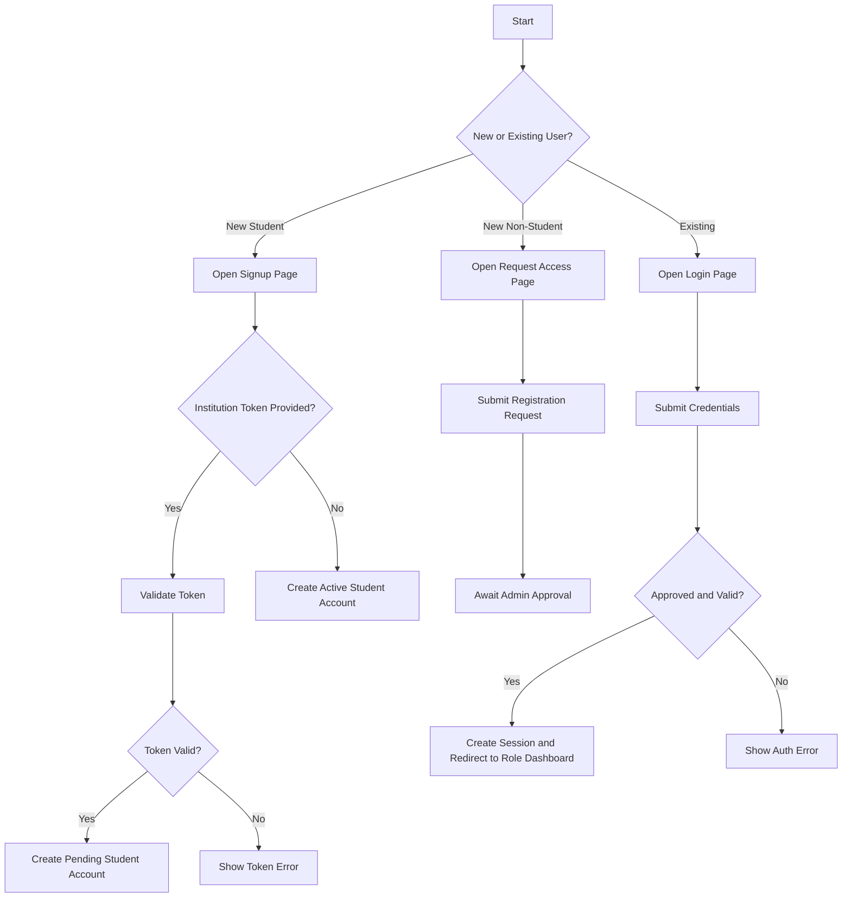

### 5.5 Browser Test Screenshots

| Screenshot Reference | Browser Action | Expected Result | Placeholder |
| --- | --- | --- | --- |
| Screenshot AUTH-01: Login Page | Open `/login` | Login form loads with email and password fields | `[Insert Screenshot Here - Login Page]` |
| Screenshot AUTH-02: Student Signup | Submit `/signup` with valid student data | Student account is created or pending notice is shown | `[Insert Screenshot Here - Student Signup Result]` |
| Screenshot AUTH-03: Approval Pending Message | Login with pending non-student or student account | Clear approval-pending message is shown | `[Insert Screenshot Here - Approval Pending Error]` |
| Screenshot AUTH-04: Dashboard Redirect | Login with approved credentials | User lands on role-specific dashboard | `[Insert Screenshot Here - Role Dashboard After Login]` |

### 5.6 Notes

- Capture both success and blocked-login states for the manual.
- If seeded users are used, record the role and email in the screenshot caption.

## 6. Module 2: Profile, Verification, and Settings

### 6.1 Purpose

This module lets users maintain identity, publish proof, connect GitHub, enrich public LinkedIn data, submit institution tokens, track onboarding, and configure settings.

### 6.2 Module Details

| Item | Details |
| --- | --- |
| Purpose | Manage trust, discoverability, profile completeness, and role-specific preferences |
| Key features | Profile update, GitHub OAuth and repository import, LinkedIn enrichment, institution token submission, settings tabs, onboarding status |
| User roles involved | All roles; institution token submission is student-only |
| Inputs | Display name, avatar URL, bio, domain, LinkedIn URL, GitHub connection, settings preferences, institution token |
| Outputs | Updated profile, imported repositories, enriched profile fields, public profile slug, updated settings, verification status |
| Validations | Settings payload must include at least one field; display name max 80; bio max 500 in settings; role settings are filtered by role; investor minimum cannot exceed maximum |
| Business rules | Students can submit institution token after profile completion; GitHub proof is only relevant for supported roles; role settings persist only fields allowed for that role; profile visibility impacts public access |
| Dependencies | User API, Auth API, settings service, GitHub and LinkedIn helper services |
| Error handling scenarios | Invalid LinkedIn URL, GitHub sync failure, unsupported role settings, invalid institution token, validation errors |
| API interaction summary | `/api/users/me`, `/api/users/me/social-enrich`, `/api/users/me/github/oauth/start`, `/api/users/me/github/sync`, `/api/users/me/github/import`, `/api/users/me/onboarding`, `/api/settings` |
| UI pages/components involved | `UserProfilePage`, `SettingsPage`, `OnboardingChecklist`, `StudentGithubProofPrompt` |

### 6.3 Functionality-wise User Manual

#### Feature: Update Profile and Build Proof Layer

**Description:** Lets a user update personal profile information and connect proof signals.  
**Preconditions:** User is logged in.  
**Steps:**

1. Open `/dashboard/profile`.
2. Update display name, domain, avatar URL, and bio.
3. Save the profile.
4. If GitHub is supported for the role, connect GitHub and import repositories.
5. If LinkedIn data is needed, save LinkedIn URL and trigger public-data fetch.

**Expected result:** Profile information is updated and proof signals appear in the profile.  
**Success / failure messages:**  
- Success: "Profile updated", GitHub proof refresh notice, LinkedIn import notice.  
- Failure: invalid URL, OAuth failure, import failure, or API error.

**Role permissions:** All roles.  
**Notes / exceptions:** GitHub proof is currently relevant for student and mentor roles.

#### Feature: Student Institution Verification

**Description:** Allows a student to submit an institution token after profile completion.  
**Preconditions:** User is logged in as student and profile is complete.  
**Steps:**

1. Open `/dashboard/profile`.
2. Review verification status panel.
3. Enter institution token.
4. Submit the token.

**Expected result:** The student account moves to institution review if the token is valid.  
**Success / failure messages:**  
- Success: token submitted successfully, waiting for institution review.  
- Failure: invalid token, expired token, token mismatch, profile incomplete.

**Role permissions:** Student only.  
**Notes / exceptions:** Verified students can open and copy their public profile link.

#### Feature: Update Settings

**Description:** Allows the user to update account, notifications, privacy, appearance, and role settings.  
**Preconditions:** User is logged in.  
**Steps:**

1. Open `/dashboard/settings`.
2. Select a settings tab.
3. Modify values.
4. Save changes for the active tab.

**Expected result:** Settings are stored and reflected in the UI or user state.  
**Success / failure messages:**  
- Success: "Saved".  
- Failure: validation error, such as investor minimum investment larger than maximum.

**Role permissions:** All roles.  
**Notes / exceptions:** Role settings differ by role:

- Student: job seeking, mentorship openness, innovation visibility
- Investor: deal flow notifications, investment range, sectors
- Mentor: availability, session types, max students
- Recruiter: actively hiring, preferred roles
- School and College: public profile, student applications

### 6.4 Flow Diagram

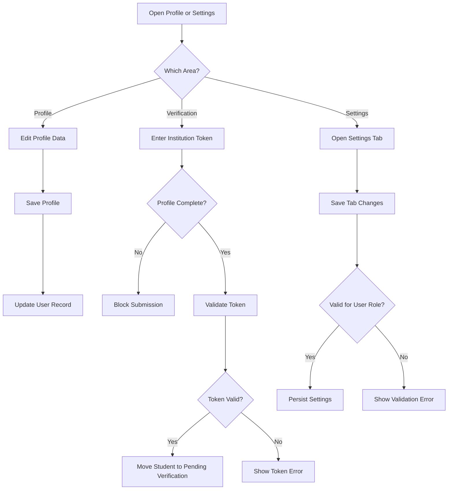

### 6.5 Browser Test Screenshots

| Screenshot Reference | Browser Action | Expected Result | Placeholder |
| --- | --- | --- | --- |
| Screenshot PROF-01: Profile Page | Open `/dashboard/profile` | Profile summary, proof section, and form render correctly | `[Insert Screenshot Here - Profile Page]` |
| Screenshot PROF-02: Institution Token Submission | Submit valid student token | Verification status changes to pending or verified | `[Insert Screenshot Here - Institution Token Submission]` |
| Screenshot PROF-03: GitHub Proof | Connect GitHub and import repositories | Imported repository cards appear | `[Insert Screenshot Here - GitHub Proof Layer]` |
| Screenshot SET-01: Settings Page | Open `/dashboard/settings` and save a tab | Save state and updated settings appear | `[Insert Screenshot Here - Settings Saved]` |

### 6.6 Notes

- Capture one screenshot per settings tab if the manual will be used for training.
- Use a student account for verification screenshots and a non-student account for role settings screenshots.

## 7. Module 3: Problem Bank

### 7.1 Purpose

This module helps students discover curated problems, review detail pages, claim a problem, and submit problem review requests.

### 7.2 Module Details

| Item | Details |
| --- | --- |
| Purpose | Turn problem discovery into student execution and workspace creation |
| Key features | Problem listing, problem detail, problem leaderboard, problem claim, review request |
| User roles involved | Student, Admin |
| Inputs | Search/filter values, selected problem, review request payload |
| Outputs | Problem list, problem detail, leaderboard, created workspace or claim result |
| Validations | Student-only access; valid problem ID required |
| Business rules | Claiming a problem starts the execution workflow; duplicate or invalid claims are blocked by service rules |
| Dependencies | Workspace module, student dashboard, admin problem review queue |
| Error handling scenarios | Problem not found, already claimed, permission denied |
| API interaction summary | `/api/problems`, `/api/problems/:id`, `/api/problems/:id/leaderboard`, `/api/problems/:id/claim`, `/api/problems/:id/review-request` |
| UI pages/components involved | `ProblemBank`, admin problem review components |

### 7.3 Functionality-wise User Manual

#### Feature: Browse and Review Problems

**Description:** Displays available problems and their key detail.  
**Preconditions:** User is logged in as student.  
**Steps:**

1. Open `/problem-bank`.
2. Browse the problem list.
3. Apply search or filters if available.
4. Open a problem card to view detail and leaderboard data.

**Expected result:** Relevant problem statements and detail are displayed.  
**Success / failure messages:**  
- Success: list and detail render normally.  
- Failure: empty state or fetch error message.

**Role permissions:** Student only.

#### Feature: Claim a Problem

**Description:** Starts student execution from a selected problem.  
**Preconditions:** Problem is available and student is logged in.  
**Steps:**

1. Open a problem detail.
2. Select the claim action.
3. Confirm the action if prompted.

**Expected result:** A workspace or execution context is created or linked.  
**Success / failure messages:**  
- Success: problem is claimed and workspace flow opens.  
- Failure: duplicate claim, invalid problem, or blocked claim.

**Role permissions:** Student only.

### 7.4 Flow Diagram

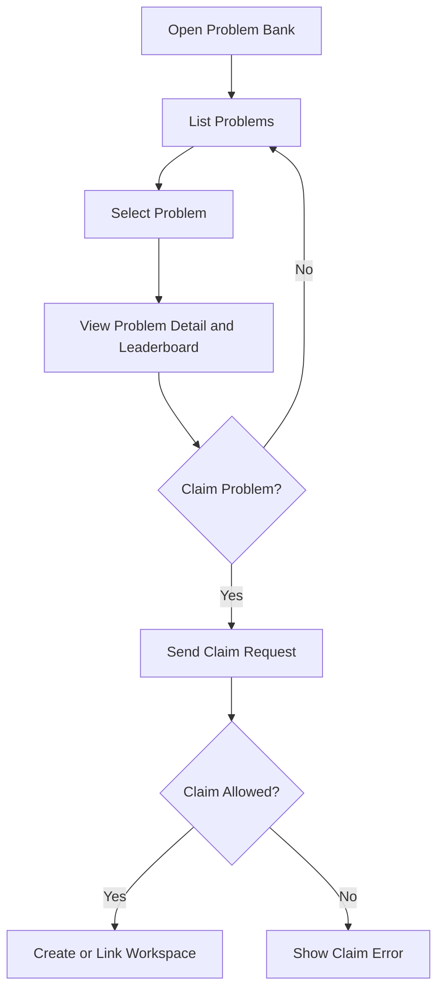

### 7.5 Browser Test Screenshots

| Screenshot Reference | Browser Action | Expected Result | Placeholder |
| --- | --- | --- | --- |
| Screenshot PB-01: Problem List | Open `/problem-bank` | Problem cards and filters are visible | `[Insert Screenshot Here - Problem Bank List]` |
| Screenshot PB-02: Problem Detail | Open one problem | Problem details and leaderboard are visible | `[Insert Screenshot Here - Problem Detail]` |
| Screenshot PB-03: Problem Claimed | Claim a problem | User is routed into workspace or claim success view | `[Insert Screenshot Here - Problem Claimed Successfully]` |

### 7.6 Notes

- For complete coverage, capture a negative screenshot showing a blocked or duplicate claim.

## 8. Module 4: Workspace and Collaboration

### 8.1 Purpose

This module is the student execution workspace. It manages workspaces, tasks, progress updates, asset uploads, repository proof, code proof, team invitations, and workspace chat.

### 8.2 Module Details

| Item | Details |
| --- | --- |
| Purpose | Support student project execution after a problem is claimed or a workspace is created |
| Key features | Workspace CRUD, tasks, progress, uploads, repo submission, code submission, member invite/remove, workspace chat |
| User roles involved | Student; workspace chat history can also be viewed by authorized mentor or investor |
| Inputs | Workspace title and metadata, task details, progress note, upload file, repo/code links, invited user |
| Outputs | Updated workspace, task list, upload list, chat history |
| Validations | Student-only workspace management; upload file types restricted to PDF and images; upload size max 10 MB |
| Business rules | Workspace access is scoped to owner and members; member and chat-participant actions require workspace context |
| Dependencies | Problem Bank, user search, chat history, Cloudinary upload handling |
| Error handling scenarios | Invalid workspace ID, invalid upload type, unauthorized member action, missing task |
| API interaction summary | `/api/workspace/*`, `/api/chat/workspace/:workspaceId` |
| UI pages/components involved | `ProductWorkspace`, `useWorkspaceChat`, `StudentWorkspaceTabs` |

### 8.3 Functionality-wise User Manual

#### Feature: Create or Open a Workspace

**Description:** Opens a student workspace created from problem claim or manual workspace creation.  
**Preconditions:** Student is logged in.  
**Steps:**

1. Open `/product-workspace/:projectId?`.
2. If a workspace exists, select it from the list.
3. If creating manually, fill the workspace form and save.

**Expected result:** Workspace detail is displayed with execution tabs.  
**Role permissions:** Student only.

#### Feature: Manage Tasks, Progress, and Proof

**Description:** Lets the student run execution activity inside the workspace.  
**Preconditions:** Workspace exists.  
**Steps:**

1. Open a workspace.
2. Add a task and assign status or details.
3. Add a progress update.
4. Upload a PDF or image asset if needed.
5. Add repository or code submission links.

**Expected result:** Workspace content updates immediately and remains visible in the execution history.  
**Success / failure messages:**  
- Success: updated task list, uploads, or submissions.  
- Failure: invalid file type, oversize upload, or missing field.

**Role permissions:** Student only.

#### Feature: Manage Collaboration and Workspace Chat

**Description:** Supports workspace members and discussion.  
**Preconditions:** Workspace exists and the student has access.  
**Steps:**

1. Open a workspace.
2. Invite a teammate if collaboration is required.
3. Remove a member if access must be revoked.
4. Open the workspace chat panel.
5. Review historical chat and continue the conversation.

**Expected result:** Members and chat participants are updated; chat history loads successfully.  
**Role permissions:** Student only for workspace management; mentors and investors may view authorized chat history through scoped access.

### 8.4 Flow Diagram

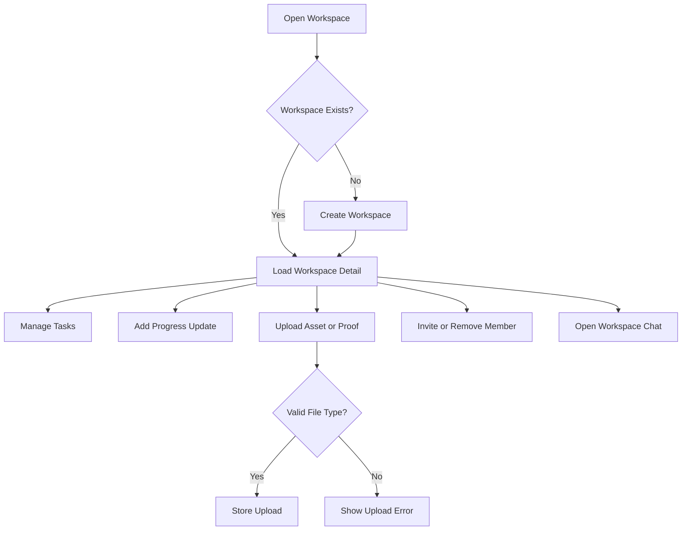

### 8.5 Browser Test Screenshots

| Screenshot Reference | Browser Action | Expected Result | Placeholder |
| --- | --- | --- | --- |
| Screenshot WS-01: Workspace Detail | Open `/product-workspace/:projectId` | Workspace tabs and detail panel render | `[Insert Screenshot Here - Workspace Detail]` |
| Screenshot WS-02: Task Added | Add a task | Task appears in workspace list | `[Insert Screenshot Here - Workspace Task Added]` |
| Screenshot WS-03: File Upload | Upload a valid asset | Upload appears in workspace assets list | `[Insert Screenshot Here - Workspace Asset Upload]` |
| Screenshot WS-04: Chat Panel | Open workspace chat | History and input area load correctly | `[Insert Screenshot Here - Workspace Chat]` |

### 8.6 Notes

- Include one negative screenshot for invalid file type or rejected upload.

## 9. Module 5: Patent Support

### 9.1 Purpose

This module lets students file patents directly, request assisted filing, review their own submissions, and publish showcased patents to shared views.

### 9.2 Module Details

| Item | Details |
| --- | --- |
| Purpose | Convert student innovation into a patent filing workflow with optional admin review and marketplace visibility |
| Key features | Patent submission, patent list, showcase toggle, assisted patent request submission |
| User roles involved | Student, Admin, authenticated viewers of showcased patents |
| Inputs | Patent filing data, request details, showcase preference |
| Outputs | Patent record, patent request, showcased patent flag |
| Validations | Student-only filing routes; valid patent/request ID required |
| Business rules | Approved patents can contribute to score and visibility; showcased patents are visible in shared surfaces |
| Dependencies | Student profile, startup readiness, admin moderation, marketplace patent showcase |
| Error handling scenarios | Missing filing data, invalid record ID, unauthorized access |
| API interaction summary | `/api/patents/submit`, `/api/patents/mine`, `/api/patents/:id/showcase`, `/api/patents/requests/*`, `/api/patents/showcased` |
| UI pages/components involved | `PatentSupport`, `PatentShowcase`, admin patent moderation screens |

### 9.3 Functionality-wise User Manual

#### Feature: Submit a Patent

**Description:** Allows a student to self-file a patent submission.  
**Preconditions:** Student is logged in.  
**Steps:**

1. Open `/patent-support/:innovationId?`.
2. Complete the filing form.
3. Submit the patent.

**Expected result:** The patent is stored in the student's patent history.  
**Success / failure messages:**  
- Success: patent record created.  
- Failure: validation or submission error.

**Role permissions:** Student only.

#### Feature: Submit an Assisted Patent Request

**Description:** Allows a student to ask for a guided or assisted patent filing process.  
**Preconditions:** Student is logged in.  
**Steps:**

1. Open patent support.
2. Choose the assisted filing request path.
3. Complete the request and submit.

**Expected result:** A patent request record is created and visible in the "my requests" view.  
**Role permissions:** Student only.

#### Feature: Showcase a Patent

**Description:** Allows the student to expose a patent in platform-facing views after submission.  
**Preconditions:** Student has a patent record.  
**Steps:**

1. Open the patent list.
2. Select the showcase toggle on a chosen patent.

**Expected result:** Showcased flag updates successfully.  
**Role permissions:** Student only.

### 9.4 Flow Diagram

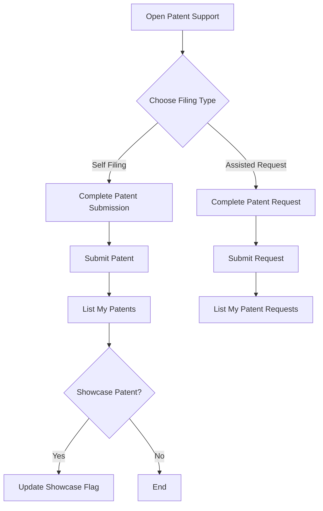

### 9.5 Browser Test Screenshots

| Screenshot Reference | Browser Action | Expected Result | Placeholder |
| --- | --- | --- | --- |
| Screenshot PAT-01: Patent Form | Open patent support form | Filing fields are visible | `[Insert Screenshot Here - Patent Submission Form]` |
| Screenshot PAT-02: Patent Submitted | Submit a valid patent | Patent appears in user history | `[Insert Screenshot Here - Patent Submitted]` |
| Screenshot PAT-03: Showcase Toggle | Enable showcase for a patent | Patent state updates successfully | `[Insert Screenshot Here - Patent Showcased]` |

### 9.6 Notes

- Capture a screenshot of admin review separately in the admin section because that is the moderation side of this module.

## 10. Module 6: Startup Launch and Cap Table

### 10.1 Purpose

This module helps a student transform work into a structured startup record, request review, upload legal and pitch documents, launch to investors/mentors/recruiters, and inspect cap table information.

### 10.2 Module Details

| Item | Details |
| --- | --- |
| Purpose | Move student innovation from draft startup profile to review-ready and launch-ready startup operations |
| Key features | Create startup, edit overview, upload pitch, upload legal/IP documents, request review, launch visibility, promote or demote co-founders, cap table view |
| User roles involved | Student, Admin, Investor |
| Inputs | Startup identity, business profile, registration profile, pitch deck PDF, legal/IP documents, launch target |
| Outputs | Startup record, review status, launch flags, cap table visibility |
| Validations | Pitch deck must be PDF up to 10 MB; startup documents must be PDF or image up to 3 MB; only students manage startup routes |
| Business rules | Review readiness requires complete startup registration profile and required documents; admin review gate exists; cap table visibility depends on role and investor type |
| Dependencies | Student profile, workspaces, patent evidence, investor deal module, admin startup review |
| Error handling scenarios | Invalid file type, incomplete startup, unauthorized founder action |
| API interaction summary | `/api/startup`, `/api/startup/:id`, `/api/startup/:id/request-review`, `/api/startup/:id/launch`, `/api/startup/:id/upload-pitch`, `/api/startup/:id/documents`, `/api/startups/:id/cap-table` |
| UI pages/components involved | `MyStartups`, `NewStartupPage`, `StartupLaunchShell`, `StartupLaunch`, `InvestorOutreach`, `CapTable`, `StartupSectionTabs` |

### 10.3 Functionality-wise User Manual

#### Feature: Create and Complete Startup Profile

**Description:** Allows a student founder to create a startup and fill overview and registration data.  
**Preconditions:** Student is logged in.  
**Steps:**

1. Open `/startup-launch`.
2. Click **New Startup**.
3. Enter the startup overview data and save.
4. Continue filling business and registration sections until review-ready.

**Expected result:** The startup appears in the "My Startups" list with a review badge.  
**Success / failure messages:**  
- Success: startup created as draft.  
- Failure: validation error or save failure.

**Role permissions:** Student only.

#### Feature: Upload Pitch and Supporting Documents

**Description:** Adds pitch deck and legal/IP proof to the startup profile.  
**Preconditions:** Startup exists.  
**Steps:**

1. Open the startup overview.
2. Upload a PDF pitch deck.
3. Upload required supporting documents by category.

**Expected result:** Files are stored and linked to the startup profile.  
**Success / failure messages:**  
- Success: uploaded file appears in startup record.  
- Failure: invalid file type or size.

**Role permissions:** Student only.

#### Feature: Request Review and Launch Startup

**Description:** Moves the startup through project completion, patent approval, investor pitch listing, and marketplace visibility.
**Preconditions:** Startup is sufficiently complete and linked to a completed project workspace.
**Steps:**

1. Open the startup overview.
2. Complete the linked project workspace and sync any needed workspace members.
3. Submit the patent request from Patent Support and wait for admin approval.
4. Select **Request Review** for the startup profile.
5. Once the startup and patent approvals are complete, launch to investors for pitch listing.
6. Track investor approval and deal activity from Investor Outreach, Investor Deals, and Cap Table.

**Expected result:** Review status changes and launch targets become visible on the platform.  
**Success / failure messages:**  
- Success: review request accepted, launch flags updated.  
- Failure: `STARTUP_INCOMPLETE`, `PROJECT_NOT_COMPLETE`, `PATENT_APPROVAL_REQUIRED`, or another blocked review/launch action.

**Role permissions:** Student only; admin reviews the startup separately.

### 10.4 Flow Diagram

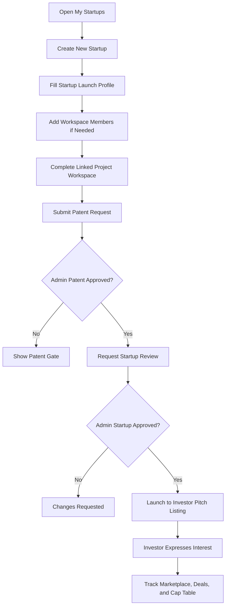

### 10.5 Browser Test Screenshots

| Screenshot Reference | Browser Action | Expected Result | Placeholder |
| --- | --- | --- | --- |
| Screenshot SU-01: My Startups | Open `/startup-launch` | Startup list and review badges are visible | `[Insert Screenshot Here - My Startups]` |
| Screenshot SU-02: New Startup Form | Create a startup | Startup form renders and saves | `[Insert Screenshot Here - New Startup Form]` |
| Screenshot SU-03: Investor Outreach Tab | Open investor outreach for a startup | Readiness cards and investor list appear | `[Insert Screenshot Here - Investor Outreach]` |
| Screenshot SU-04: Cap Table | Open cap table view | Share allocation and investor visibility are shown | `[Insert Screenshot Here - Startup Cap Table]` |

### 10.6 Notes

- Capture one screenshot where the review badge shows `Draft` and one where it shows `Approved` or `Under Review`.

## 11. Module 7: Marketplace and Public Profiles

### 11.1 Purpose

This module lets students, schools, and colleges browse marketplace profiles and lets verified student public profiles be shared externally.

### 11.2 Module Details

| Item | Details |
| --- | --- |
| Purpose | Expose discoverable proof and partner profiles inside the platform and via public student links |
| Key features | Marketplace directory, entity detail, recruiter public job detail, public student profile |
| User roles involved | Student, School, College, public external viewers for student profile slug |
| Inputs | Search text, entity type, selected profile/job |
| Outputs | Directory results, profile detail drawer, public proof page |
| Validations | Marketplace API is limited to student, school, and college roles; public student profile requires valid slug |
| Business rules | Public student profile becomes meaningful after verification and proof completion; school cannot access recruiter resources through school-only module routes |
| Dependencies | User profile, startup data, patent showcase, recruiter public jobs |
| Error handling scenarios | Missing user, invalid slug, unsupported entity detail |
| API interaction summary | `/api/marketplace`, `/api/marketplace/:userId`, `/api/marketplace/entities/:entityType/:entityId`, `/api/users/public/:profileSlug`, `/api/recruiter/jobs/public/*` |
| UI pages/components involved | `Marketplace`, `MarketplaceJobDetail`, `PublicStudentProfilePage`, profile drawers |

### 11.3 Functionality-wise User Manual

#### Feature: Browse Marketplace Profiles

**Description:** Lets eligible roles browse mentors, investors, recruiters, and related marketplace entities.  
**Preconditions:** User is logged in as student, school, or college.  
**Steps:**

1. Open `/marketplace`.
2. Search or filter the directory.
3. Open a profile drawer or entity detail.

**Expected result:** Partner cards and profile detail are shown.  
**Role permissions:** Student, School, College.

#### Feature: Open a Public Student Profile

**Description:** Displays a shareable student profile using the public slug route.  
**Preconditions:** Student profile slug exists.  
**Steps:**

1. Copy the public profile URL from the profile page.
2. Open `/students/:profileSlug`.

**Expected result:** Public student proof page renders with profile and proof data.  
**Role permissions:** Public route.

### 11.4 Flow Diagram

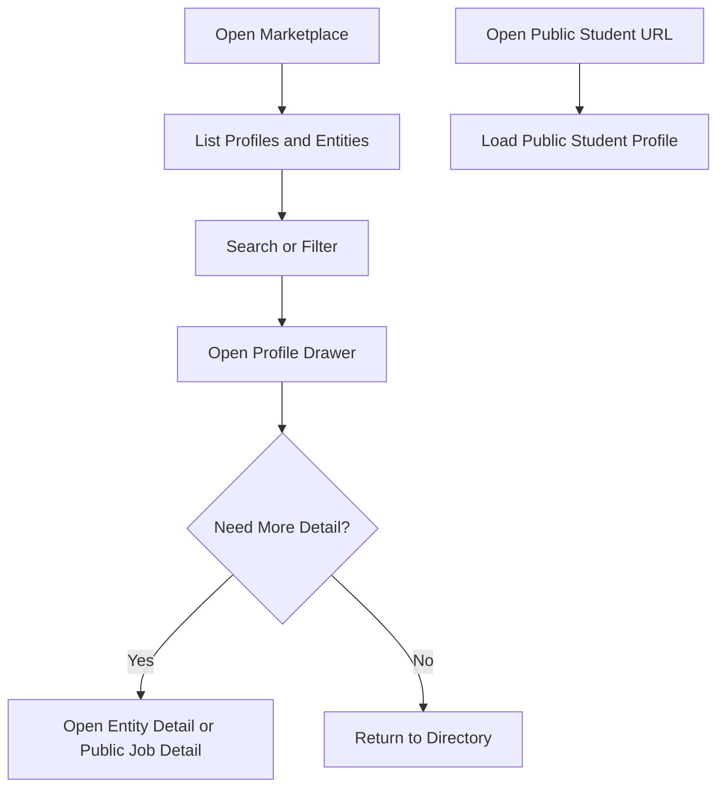

### 11.5 Browser Test Screenshots

| Screenshot Reference | Browser Action | Expected Result | Placeholder |
| --- | --- | --- | --- |
| Screenshot MK-01: Marketplace Directory | Open `/marketplace` | Directory tiles load | `[Insert Screenshot Here - Marketplace Directory]` |
| Screenshot MK-02: Profile Drawer | Open a marketplace profile | Detailed profile drawer appears | `[Insert Screenshot Here - Marketplace Profile Drawer]` |
| Screenshot MK-03: Public Student Profile | Open `/students/:profileSlug` | Shareable student profile loads | `[Insert Screenshot Here - Public Student Profile]` |

### 11.6 Notes

- Use a verified student with GitHub or patent proof for the public-profile screenshot.

## 12. Module 8: Investor Discovery, Interest, and Deal Progression

### 12.1 Purpose

This module lets investors discover startups, review proof-rich profiles, express interest, progress deal stages, and manage portfolio visibility and authority.

### 12.2 Module Details

| Item | Details |
| --- | --- |
| Purpose | Convert startup discovery into governed investment workflow |
| Key features | Investor dashboard, startup discovery, startup detail review, express penny or sole interest, deal stage progression, portfolio, authority view |
| User roles involved | Investor, Student, Admin |
| Inputs | Startup filters, investment type, proposed amount, proposed equity, chosen role, stage transition data |
| Outputs | Deal record, deal list, deal detail, authority view, portfolio data |
| Validations | Minimum investment INR 20,000; penny equity max 5%; equity must be within available share pool; sole investor must be unique; director role for sole investor requires at least 51% equity |
| Business rules | Penny investors cannot request director authority; collective penny investors cannot exceed 49% cap; stage 3 to stage 4 requires admin approval; cap table visibility is limited for penny investors |
| Dependencies | Startup launch, cap table, admin review, student founder data |
| Error handling scenarios | `DIRECTOR_ROLE_RESERVED`, `SOLE_INVESTOR_EXISTS`, `VALIDATION_ERROR`, `INSUFFICIENT_SHARES`, `PENNY_EQUITY_CAP`, blocked stage change |
| API interaction summary | `/api/investor/dashboard`, `/api/investor/startups`, `/api/investor/startups/:id`, `/api/investor/express-interest/:startupId`, `/api/investor/startups/:id/sole-investor`, `/api/investor/deals/*`, `/api/investor/portfolio`, `/api/deals/*` |
| UI pages/components involved | `InvestorDashboard`, `StartupMarketplace`, `StartupDetailDrawer`, `Portfolio`, `DealDetail` |

### 12.3 Functionality-wise User Manual

#### Feature: Browse Startups and Review Detail

**Description:** Lets the investor review startup readiness, founder proof, score breakdown, and pitch deck.  
**Preconditions:** Investor is logged in.  
**Steps:**

1. Open `/dashboard/investor/startups`.
2. Search or filter startups.
3. Open a startup detail drawer.
4. Review founder scores, pitch deck, share availability, and investor acceptance flags.

**Expected result:** Startup detail loads with full context before investment action.  
**Role permissions:** Investor only.

#### Feature: Express Investor Interest

**Description:** Creates a penny or sole investment intent.  
**Preconditions:** Startup accepts the selected investor type.  
**Steps:**

1. Open startup detail.
2. Select `Penny Investor` or `Sole Investor`.
3. Enter amount, equity percent, and authority role.
4. Submit the interest request.

**Expected result:** A deal is created if the request satisfies business rules.  
**Success / failure messages:**  
- Success: deal created successfully.  
- Failure: sole investor already exists, minimum amount too low, insufficient shares, penny cap exceeded, disallowed authority selection.

**Role permissions:** Investor only.

#### Feature: Progress Deal Stages

**Description:** Moves a deal through the investment lifecycle.  
**Preconditions:** Deal exists for the investor.  
**Steps:**

1. Open investor deals or portfolio.
2. Select a deal.
3. Advance the deal stage in sequence.
4. Submit stage-3 data and wait for admin approval.
5. After approval, advance to stage 4.

**Expected result:** Deal state updates in a controlled sequence.  
**Role permissions:** Investor only; admin approval required for the stage-3 to stage-4 gate.

### 12.4 Flow Diagram

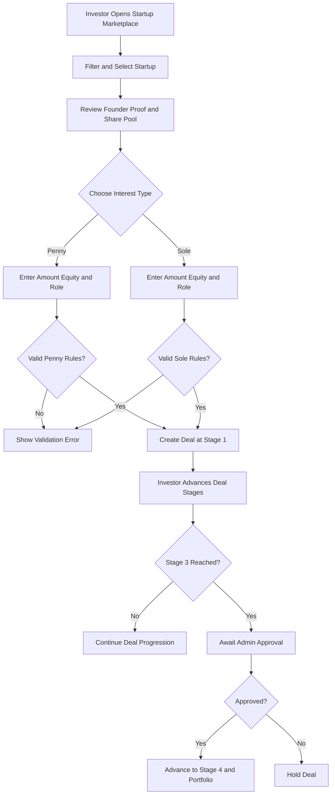

### 12.5 Browser Test Screenshots

| Screenshot Reference | Browser Action | Expected Result | Placeholder |
| --- | --- | --- | --- |
| Screenshot INV-01: Startup Marketplace | Open `/dashboard/investor/startups` | Startup cards and filters appear | `[Insert Screenshot Here - Investor Startup Marketplace]` |
| Screenshot INV-02: Startup Detail Drawer | Open a startup | Founder score, pitch deck, and investment form appear | `[Insert Screenshot Here - Investor Startup Detail]` |
| Screenshot INV-03: Express Interest Success | Submit valid investor interest | Deal creation confirmation appears | `[Insert Screenshot Here - Investor Express Interest Success]` |
| Screenshot INV-04: Portfolio | Open `/dashboard/investor/portfolio` | Active portfolio items and authority indicators appear | `[Insert Screenshot Here - Investor Portfolio]` |

### 12.6 Notes

- Capture one negative screenshot for a blocked penny director request or below-minimum investment.

## 13. Module 9: Recruiter Talent, Jobs, Drives, and Onboarding

### 13.1 Purpose

This module supports recruiter hiring operations across talent search, jobs, campus drives, messaging, and onboarding.

### 13.2 Module Details

| Item | Details |
| --- | --- |
| Purpose | Help recruiters discover talent and move candidates into jobs, drives, and hiring outcomes |
| Key features | Dashboard, talent pipeline, talent discover, student profile review, shortlist, message, job CRUD, public job detail, drive management, onboarding tracker, hire action |
| User roles involved | Recruiter, Student, College |
| Inputs | Talent filters, job form, drive form, message text, student hire action |
| Outputs | Shortlist state, sent message, job record, drive record, onboarding updates, placement updates |
| Validations | Talent query min/max score 0-200; job title/company/domain/location required; job description min 10 chars; drive requires valid college ID and date; drive score 0-100; message min 2 chars when provided |
| Business rules | Messaging is gated by relevance/contact rules; student can apply only to public jobs; student can register for drives; recruiter can mark a connected student as hired; college placement status is updated through recruiter-college integration |
| Dependencies | Student profile, placement tracker, direct messaging, college directory |
| Error handling scenarios | Contact blocked by relevance guard, invalid job or drive ID, invalid score, unauthorized student view |
| API interaction summary | `/api/recruiter/dashboard`, `/api/recruiter/talent*`, `/api/recruiter/shortlist/:studentId`, `/api/recruiter/message/:studentId`, `/api/recruiter/jobs*`, `/api/recruiter/drives*`, `/api/recruiter/colleges`, `/api/recruiter/onboarding`, `/api/recruiter/hired/:studentId` |
| UI pages/components involved | `RecruiterDashboard`, `TalentSearch`, `StudentProfileDrawer`, `ActiveDrives`, `CollegeConnect`, `OnboardingTracker`, `RecruiterMessagesPage` |

### 13.3 Functionality-wise User Manual

#### Feature: Search and Shortlist Talent

**Description:** Lets a recruiter review top-matched students and build a shortlist.  
**Preconditions:** Recruiter is logged in.  
**Steps:**

1. Open `/dashboard/recruiter` or `/dashboard/recruiter/talent`.
2. Search by name, domain, institution, or score.
3. Open a student profile.
4. Add the student to shortlist.

**Expected result:** Student appears in the recruiter pipeline or shortlist.  
**Role permissions:** Recruiter only.

#### Feature: Create Jobs and Campus Drives

**Description:** Lets the recruiter publish job openings and organize campus drives.  
**Preconditions:** Recruiter is logged in.  
**Steps:**

1. Open recruiter dashboard.
2. Select **Post a Job** or **Start a Campus Drive**.
3. Enter required form data.
4. Save the record.

**Expected result:** Job or drive is created and listed in recruiter views.  
**Success / failure messages:**  
- Success: job or drive appears in lists.  
- Failure: required-field validation, invalid score range, invalid college selection.

**Role permissions:** Recruiter only.

#### Feature: Message and Hire Students

**Description:** Supports outreach and hiring outcome tracking.  
**Preconditions:** Recruiter has valid contact scope or relevance bridge to the student.  
**Steps:**

1. Run message eligibility check or open the student profile.
2. Send a message if allowed.
3. Open onboarding tracker after progress is made.
4. Mark a student as hired.

**Expected result:** Message is delivered and onboarding/placement state is updated.  
**Role permissions:** Recruiter only.

### 13.4 Flow Diagram

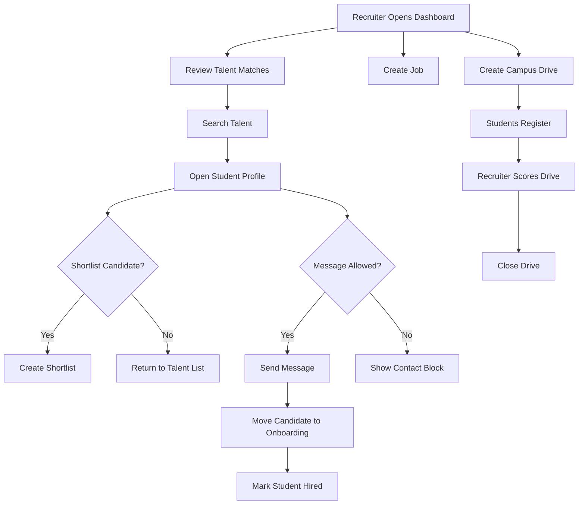

### 13.5 Browser Test Screenshots

| Screenshot Reference | Browser Action | Expected Result | Placeholder |
| --- | --- | --- | --- |
| Screenshot REC-01: Recruiter Dashboard | Open `/dashboard/recruiter` | Dashboard KPIs and quick actions appear | `[Insert Screenshot Here - Recruiter Dashboard]` |
| Screenshot REC-02: Talent Search | Search talent and open a profile | Student profile drawer appears | `[Insert Screenshot Here - Recruiter Talent Search]` |
| Screenshot REC-03: Job Creation | Create a new job | Job creation dialog saves successfully | `[Insert Screenshot Here - Recruiter Job Created]` |
| Screenshot REC-04: Onboarding Tracker | Open `/dashboard/recruiter/onboarding` | Onboarding rows and statuses are visible | `[Insert Screenshot Here - Recruiter Onboarding Tracker]` |

### 13.6 Notes

- Include one failure screenshot for blocked recruiter contact if relevance guard is active.

## 14. Module 10: Mentor Dashboard, Sessions, and Feedback

### 14.1 Purpose

This module allows mentors to discover students, review student and workspace context, schedule sessions, manage notes, and submit feedback.

### 14.2 Module Details

| Item | Details |
| --- | --- |
| Purpose | Formalize mentor interaction and session delivery |
| Key features | Mentor dashboard, student feed, student profile, workspace view, session CRUD, feedback submission |
| User roles involved | Mentor, Student |
| Inputs | Student selection, session data, mentor notes, meet link, feedback text, rating |
| Outputs | Session record, updated notes, feedback record |
| Validations | Session title 2-160 chars; scheduled date must be valid datetime; duration 15-240 minutes; meet link must be URL if present; feedback text 10-4000 chars; rating 1-5 |
| Business rules | Mentor routes are mentor-only; access to student resources is connection-guarded; mentor notes are editable for 24 hours after completion in the current UI pattern |
| Dependencies | Student profile, workspace, notifications, mentor socket namespace |
| Error handling scenarios | Invalid student/workspace ID, unsupported connection, invalid URL, validation errors |
| API interaction summary | `/api/mentor/dashboard`, `/api/mentor/students`, `/api/mentor/students/:id`, `/api/mentor/students/:id/workspace/:workspaceId`, `/api/mentor/sessions*`, `/api/mentor/feedback/:studentId` |
| UI pages/components involved | `MentorDashboard`, `StudentFeed`, `StudentProfileDrawer`, `Sessions` |

### 14.3 Functionality-wise User Manual

#### Feature: Review Students and Authorized Workspaces

**Description:** Lets a mentor explore students and open detailed proof and workspace context.  
**Preconditions:** Mentor is logged in and has connection scope.  
**Steps:**

1. Open `/dashboard/mentor/students`.
2. Review the student feed.
3. Open a student profile.
4. If authorized, open the linked workspace detail.

**Expected result:** Student and workspace context load successfully.  
**Role permissions:** Mentor only.

#### Feature: Schedule and Manage Sessions

**Description:** Lets the mentor create and manage student sessions.  
**Preconditions:** Mentor is logged in.  
**Steps:**

1. Open `/dashboard/mentor/sessions`.
2. Click **Schedule Session**.
3. Select student, set title, date/time, duration, optional workspace, and meet link.
4. Save the session.
5. Later update status, notes, or meet link as needed.

**Expected result:** Session appears in upcoming, completed, or cancelled tabs.  
**Role permissions:** Mentor only.

#### Feature: Submit Feedback

**Description:** Lets the mentor submit feedback for a student.  
**Preconditions:** Mentor has access to the student.  
**Steps:**

1. Open the student profile or relevant feedback action.
2. Enter feedback text and rating.
3. Submit the feedback.

**Expected result:** Feedback is stored for the student context.  
**Role permissions:** Mentor only.

### 14.4 Flow Diagram

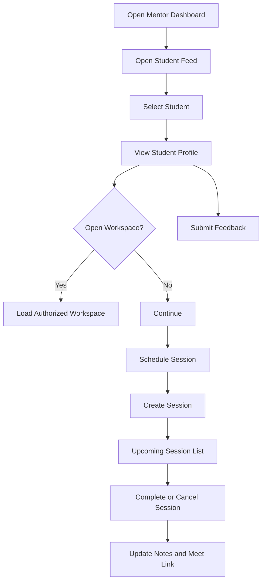

### 14.5 Browser Test Screenshots

| Screenshot Reference | Browser Action | Expected Result | Placeholder |
| --- | --- | --- | --- |
| Screenshot MEN-01: Mentor Dashboard | Open `/dashboard/mentor` | Dashboard summary cards load | `[Insert Screenshot Here - Mentor Dashboard]` |
| Screenshot MEN-02: Student Feed | Open `/dashboard/mentor/students` | Student list and schedule actions appear | `[Insert Screenshot Here - Mentor Student Feed]` |
| Screenshot MEN-03: Session Scheduler | Create a session | Session form saves and upcoming tab updates | `[Insert Screenshot Here - Mentor Session Scheduled]` |
| Screenshot MEN-04: Feedback Submission | Submit mentor feedback | Feedback success state appears | `[Insert Screenshot Here - Mentor Feedback Submitted]` |

### 14.6 Notes

- Capture both scheduled and completed session screenshots for training material.

## 15. Module 11: School Operations

### 15.1 Purpose

This module gives school users an institutional dashboard for tokens, roster intake, temporary student credentials, pending verification review, investor and mentor visibility, and compliance reporting.

### 15.2 Module Details

| Item | Details |
| --- | --- |
| Purpose | Allow school users to verify and manage student innovation participation |
| Key features | Dashboard stats, student tokens, roster intake, temp credentials, pending verifications, investor directory, mentor directory, compliance report |
| User roles involved | School |
| Inputs | Token label, student roster data, roster import file, temporary credential data, verification decision |
| Outputs | Access token record, roster entries, temporary student credentials, approved/rejected verification state, compliance report URL |
| Validations | School-only access; roster import limit 5 MB; temp credentials must match institution email domain |
| Business rules | School cannot access recruiter resources; institution-created temporary accounts are already active; token-submitted student accounts require school approval |
| Dependencies | Auth module, institution access service, student roster service, compliance report service, marketplace investor and mentor views |
| Error handling scenarios | domain mismatch for temp credentials, invalid roster file, invalid verification request, recruiter access blocked |
| API interaction summary | `/api/school/dashboard`, `/api/school/student-access-tokens*`, `/api/school/student-roster*`, `/api/school/student-temp-credentials`, `/api/school/student-verifications*`, `/api/school/investors`, `/api/school/compliance-report*`, `/api/school/mentorship-programs*` |
| UI pages/components involved | `School Dashboard`, `StudentLeaderboard`, `StudentJourneyDrawer`, `InvestorDirectory`, `MentorDirectory`, `ComplianceReport`, `StudentIntakePanel`, `MentorshipProgramPanel` |

### 15.3 Functionality-wise User Manual

#### Feature: Issue Student Tokens and Manage Student Intake

**Description:** Lets the school generate tokens, maintain roster records, and create temporary student accounts.  
**Preconditions:** User is logged in as school.  
**Steps:**

1. Open `/dashboard/school`.
2. In the token desk, enter an optional label and generate a token.
3. In the intake panel, add manual roster rows or import an Excel file.
4. If managed accounts are needed, create temporary student credentials.

**Expected result:** Tokens, roster entries, and temporary credentials are created.  
**Role permissions:** School only.

#### Feature: Review Student Verification Requests

**Description:** Approves or rejects students who used institution tokens.  
**Preconditions:** Pending verification records exist.  
**Steps:**

1. Open the pending approval card on the school dashboard.
2. Review student detail and verification request timing.
3. Choose **Approve** or **Reject**.

**Expected result:** Student status changes and dashboard counts refresh.  
**Role permissions:** School only.

#### Feature: Access Directories and Compliance

**Description:** Allows the school to browse investors and mentors and generate compliance evidence.  
**Preconditions:** School user is logged in.  
**Steps:**

1. Open `/dashboard/school/investors` or `/dashboard/school/mentors`.
2. Search or inspect the directory.
3. Open `/dashboard/school/compliance`.
4. Generate or download the latest compliance report.

**Expected result:** Directory data and report URL load successfully.  
**Role permissions:** School only.

### 15.4 Flow Diagram

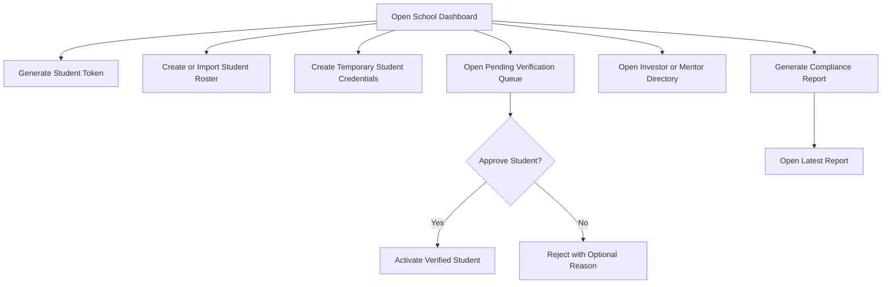

### 15.5 Browser Test Screenshots

| Screenshot Reference | Browser Action | Expected Result | Placeholder |
| --- | --- | --- | --- |
| Screenshot SCH-01: School Dashboard | Open `/dashboard/school` | Dashboard cards, tokens, and pending approvals are visible | `[Insert Screenshot Here - School Dashboard]` |
| Screenshot SCH-02: Token Desk | Generate a token | Token code appears in token list | `[Insert Screenshot Here - School Token Generated]` |
| Screenshot SCH-03: Verification Queue | Approve a pending student | Student moves out of pending queue | `[Insert Screenshot Here - School Student Approved]` |
| Screenshot SCH-04: Compliance Report | Generate report | Latest report link or viewer appears | `[Insert Screenshot Here - School Compliance Report]` |

### 15.6 Notes

- Include one screenshot of temporary credentials because it is an important training and support artifact.

## 16. Module 12: College Operations, Placement, and Events

### 16.1 Purpose

This module gives college users institution management plus recruiter visibility, placement tracking, and event scoring/rankings.

### 16.2 Module Details

| Item | Details |
| --- | --- |
| Purpose | Extend institution management with hiring and event operations |
| Key features | Dashboard, student roster and verification, recruiter directory, investor directory, placement tracker, events, ranking computation, compliance |
| User roles involved | College, Student, Recruiter |
| Inputs | Token label, roster data, verification decision, event form, submission score, placement status |
| Outputs | Tokens, roster, approved/rejected students, placement tracker data, event list, rankings, compliance report |
| Validations | College-only institution routes; placement status patch is recruiter-only on backend; event score must be 0-100; event creation requires title/date/description |
| Business rules | Colleges can access recruiters while schools cannot; event rankings combine submission score and innovation score; ranking route is visible to college, student, and recruiter roles |
| Dependencies | Institution access service, recruiter module, event service, compliance reporting |
| Error handling scenarios | invalid student or event ID, invalid score range, domain mismatch for temp credentials |
| API interaction summary | `/api/college/dashboard`, `/api/college/recruiters`, `/api/college/placement`, `/api/college/events*`, `/api/events/:eventId/*`, `/api/college/compliance-report*`, `/api/college/student-access-tokens*`, `/api/college/student-verifications*` |
| UI pages/components involved | `College Dashboard`, `StudentLeaderboard`, `RecruiterDirectory`, `PlacementTracker`, `EventManager`, `ComplianceReport`, `StudentJourneyDrawer` |

### 16.3 Functionality-wise User Manual

#### Feature: Manage College Students and Directories

**Description:** Allows the college to manage tokens, roster, pending verifications, recruiters, investors, and mentors.  
**Preconditions:** User is logged in as college.  
**Steps:**

1. Open `/dashboard/college`.
2. Use token and roster tools similar to the school flow.
3. Open `/dashboard/college/recruiters`, `/dashboard/college/investors`, or `/dashboard/college/mentors`.

**Expected result:** College data and partner directories load correctly.  
**Role permissions:** College only.

#### Feature: Track Placement Status

**Description:** Displays placement KPIs and student placement status.  
**Preconditions:** Placement data exists for the college cohort.  
**Steps:**

1. Open `/dashboard/college/placement`.
2. Review KPI cards and status table.
3. Search or filter rows as needed.

**Expected result:** Placement data is visible and current.  
**Role permissions:** College view; recruiter may update status through linked backend route.

#### Feature: Create Events, Submit Scores, and Compute Rankings

**Description:** Lets the college run institution events and generate rankings.  
**Preconditions:** College is logged in. Students may join events separately.  
**Steps:**

1. Open `/dashboard/college/events`.
2. Create an event with title, type, date, and description.
3. Wait for students to join the event.
4. Add participant submission scores.
5. Click **Compute Rankings**.

**Expected result:** Ranked event results appear using the composite score formula.  
**Success / failure messages:**  
- Success: rankings populate.  
- Failure: invalid score, missing participants, or event fetch error.

**Role permissions:** College creates and scores events; students join; recruiters and students can view ranking results.

### 16.4 Flow Diagram

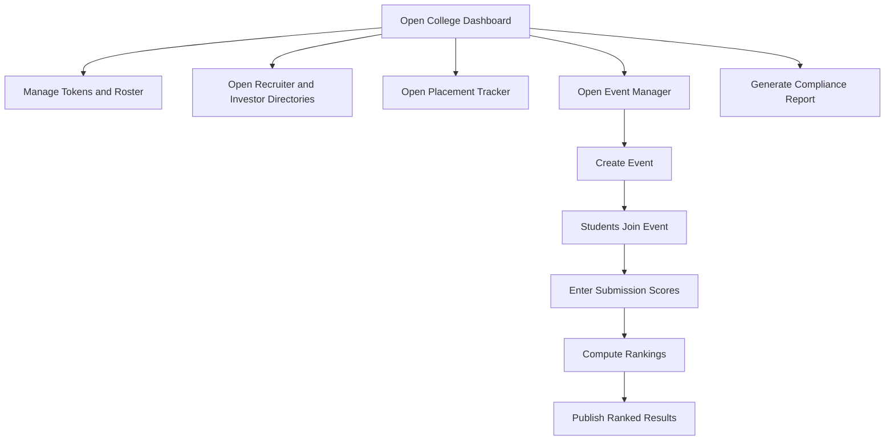

### 16.5 Browser Test Screenshots

| Screenshot Reference | Browser Action | Expected Result | Placeholder |
| --- | --- | --- | --- |
| Screenshot COL-01: College Dashboard | Open `/dashboard/college` | Dashboard summary cards appear | `[Insert Screenshot Here - College Dashboard]` |
| Screenshot COL-02: Placement Tracker | Open placement page | Placement KPIs and rows appear | `[Insert Screenshot Here - College Placement Tracker]` |
| Screenshot COL-03: Event Creation | Create an event | Event card appears in event list | `[Insert Screenshot Here - College Event Created]` |
| Screenshot COL-04: Event Rankings | Compute rankings | Ranked participant rows appear | `[Insert Screenshot Here - College Event Rankings]` |

### 16.6 Notes

- For a full manual, capture the event score entry form and the resulting rankings table.

## 17. Module 13: Notifications, Direct Messages, and Reporting

### 17.1 Purpose

This module provides in-app notification handling, direct messaging, message attachments, conversation read state, and user abuse/report submission.

### 17.2 Module Details

| Item | Details |
| --- | --- |
| Purpose | Support cross-role communication, alerts, and moderation reporting |
| Key features | Notification list, mark read, mark all read, DM conversation list, DM thread, partner profile, message send, attachment upload, report submission |
| User roles involved | All authenticated roles |
| Inputs | Notification ID, partner user ID, message text, attachment file, report payload |
| Outputs | Updated notification state, sent message, conversation state, report record |
| Validations | DM attachment types limited to JPEG, PNG, GIF, WebP, and PDF up to 10 MB; valid user IDs required |
| Business rules | Conversation access is authenticated; notification read state is user-specific; report list is limited to the reporting user |
| Dependencies | User search, recruiter/investor outreach flows, sockets, moderation processes |
| Error handling scenarios | invalid recipient, invalid attachment type, unauthorized access, message send failure |
| API interaction summary | `/api/notifications`, `/api/notifications/:id/read`, `/api/notifications/read-all`, `/api/dm/conversations`, `/api/dm/:userId`, `/api/dm/upload`, `/api/report` |
| UI pages/components involved | `MessagesPage`, `RecruiterMessagesPage`, messaging modals, notification hooks |

### 17.3 Functionality-wise User Manual

#### Feature: Review and Clear Notifications

**Description:** Allows the user to monitor notifications and clear unread state.  
**Preconditions:** User is logged in.  
**Steps:**

1. Open the notifications surface in the authenticated area.
2. Review notification items.
3. Mark an individual notification as read or mark all as read.

**Expected result:** Notification state updates successfully.  
**Role permissions:** All authenticated roles.

#### Feature: Send Direct Messages

**Description:** Allows one authenticated user to chat with another permitted user.  
**Preconditions:** User is logged in and has a conversation target.  
**Steps:**

1. Open `/dashboard/messages` or recruiter messages route.
2. Select a partner conversation or open a new thread from another module.
3. Type and send a message.
4. Optionally upload an attachment first and include it in the message.

**Expected result:** Message appears in the thread and can be marked read by the recipient.  
**Role permissions:** All authenticated roles within supported workflow access.

#### Feature: Submit a Report

**Description:** Allows a user to submit a report for moderation or support tracking.  
**Preconditions:** User is logged in.  
**Steps:**

1. Open the report action from a supported UI surface.
2. Complete the report reason and details.
3. Submit the report.

**Expected result:** Report record is stored under the reporting user.  
**Role permissions:** All authenticated roles.

### 17.4 Flow Diagram

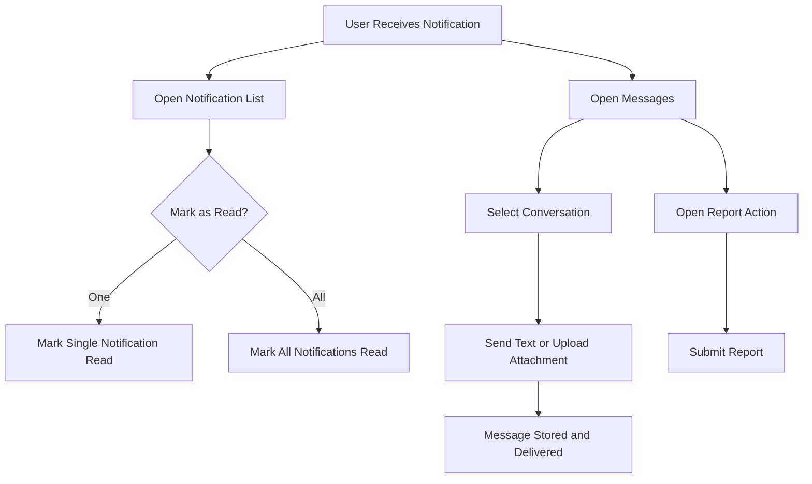

### 17.5 Browser Test Screenshots

| Screenshot Reference | Browser Action | Expected Result | Placeholder |
| --- | --- | --- | --- |
| Screenshot MSG-01: Notification List | Open notifications | Notifications are listed with read state | `[Insert Screenshot Here - Notification List]` |
| Screenshot MSG-02: DM Thread | Open a message thread | Conversation history and input load | `[Insert Screenshot Here - Direct Message Thread]` |
| Screenshot MSG-03: Attachment Upload | Upload a valid DM attachment | Attachment upload succeeds | `[Insert Screenshot Here - DM Attachment Upload]` |
| Screenshot MSG-04: Report Submission | Submit a report | Report success state appears | `[Insert Screenshot Here - Report Submitted]` |

### 17.6 Notes

- Capture one screenshot showing read-state change in the notification list.

## 18. Module 14: Admin Governance and Analytics

### 18.1 Purpose

This module lets admins control users, approve onboarding, moderate content, review startups and deals, assign mentorship, verify milestones, and inspect analytics.

### 18.2 Module Details

| Item | Details |
| --- | --- |
| Purpose | Provide governance, moderation, and operational visibility across the platform |
| Key features | User directory, registration request approvals, role change, access toggle, patent review, startup review, deal review, stage approval, investor-role update, cap table review, sole investor reset, problem bank admin, mentorship operations, analytics |
| User roles involved | Admin |
| Inputs | Review decisions, role/access updates, problem definitions, mentor assignment data, review notes, analytics filters |
| Outputs | Approved or rejected users, moderated records, updated deal states, analytics datasets |
| Validations | Admin-only routes; rejection notes required for patents and awards; analytics query limits enforced; admin count limit enforced through role-promotion logic |
| Business rules | Non-student registration requires admin approval; maximum admin credential count is limited; deal stage 3 requires admin approval before stage 4; startup review gates launch readiness; milestones can be verified for score impacts |
| Dependencies | All business modules, audit logging, analytics activity store |
| Error handling scenarios | forbidden access, invalid moderation target, admin credential limit reached, validation errors |
| API interaction summary | `/api/admin/users*`, `/api/admin/registration-requests*`, `/api/admin/problems*`, `/api/admin/patents*`, `/api/admin/startups*`, `/api/admin/deals*`, `/api/admin/mentorship-programs*`, `/api/admin/project-mentorships*`, `/api/admin/analytics*` |
| UI pages/components involved | `Admin Dashboard`, `UserManagement`, `UserRequests`, `UserDirectory`, `Patents`, `Deals`, `DealsOverview`, `DealReview`, `ProblemBank`, `MentorshipPrograms`, `MentorshipRequests`, `MentorshipMentors`, `AnalyticsTemporary` |

### 18.3 Functionality-wise User Manual

#### Feature: Review Registration Requests and Manage Users

**Description:** Allows admins to approve access, change roles, and control account activation.  
**Preconditions:** User is logged in as admin.  
**Steps:**

1. Open `/dashboard/admin/users/requests`.
2. Review pending registration requests.
3. Approve or reject the request.
4. Open the user directory if role or access must be changed.
5. Update role or activation state.

**Expected result:** User access state updates and the account can or cannot log in accordingly.  
**Role permissions:** Admin only.

#### Feature: Moderate Patents, Problems, Startups, and Mentorship Requests

**Description:** Allows admins to moderate content and operational review queues.  
**Preconditions:** Admin is logged in and review queues contain data.  
**Steps:**

1. Open the relevant admin section.
2. Review the submission detail.
3. Approve, reject, or update the record.

**Expected result:** Moderation state updates and related counters refresh.  
**Role permissions:** Admin only.

#### Feature: Review Deals and Approve Deal Stage

**Description:** Governs deals before final progression.  
**Preconditions:** Investor has reached the admin-controlled stage in the deal flow.  
**Steps:**

1. Open `/dashboard/admin/deals/overview`.
2. Open a specific deal review.
3. Review deal data, notes, stock transfer state, and investor role.
4. Approve the pending stage or update review state.

**Expected result:** Deal can move forward after approval.  
**Role permissions:** Admin only.

### 18.4 Flow Diagram

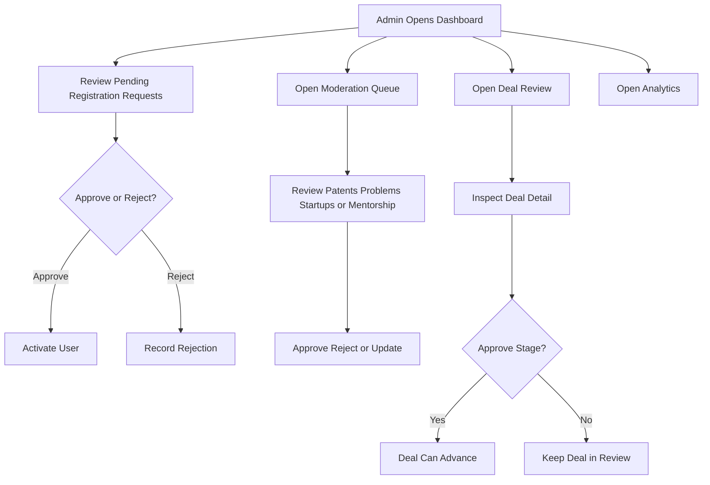

### 18.5 Browser Test Screenshots

| Screenshot Reference | Browser Action | Expected Result | Placeholder |
| --- | --- | --- | --- |
| Screenshot ADM-01: Admin Dashboard | Open `/dashboard/admin` | KPI cards and section tiles appear | `[Insert Screenshot Here - Admin Dashboard]` |
| Screenshot ADM-02: User Requests | Approve a registration request | User request status changes | `[Insert Screenshot Here - Admin User Request Approved]` |
| Screenshot ADM-03: Patent Review | Approve or reject a patent | Patent moderation result is shown | `[Insert Screenshot Here - Admin Patent Review]` |
| Screenshot ADM-04: Deal Review | Approve a deal stage | Deal review state updates successfully | `[Insert Screenshot Here - Admin Deal Review]` |

### 18.6 Notes

- The current analytics route is a temporary page in the mounted frontend, even though the backend analytics API is active.

## 19. Roles and Permissions Matrix

| Module / Functionality | Admin | Student | School | College | Mentor | Investor | Recruiter |
| --- | --- | --- | --- | --- | --- | --- | --- |
| Student signup | No | Yes | No | No | No | No | No |
| Non-student access request | No | No | Yes | Yes | Yes | Yes | Yes |
| Login and logout | Yes | Yes | Yes | Yes | Yes | Yes | Yes |
| Profile update | Yes | Yes | Yes | Yes | Yes | Yes | Yes |
| Settings update | Yes | Yes | Yes | Yes | Yes | Yes | Yes |
| Submit institution token | No | Yes | No | No | No | No | No |
| Browse problem bank | No | Yes | No | No | No | No | No |
| Manage workspace | No | Yes | No | No | No | No | No |
| View workspace chat history | No | Yes | No | No | Yes, scoped | Yes, scoped | No |
| Submit patent | No | Yes | No | No | No | No | No |
| Review patent | Yes | No | No | No | No | No | No |
| Create and manage startup | No | Yes | No | No | No | No | No |
| Review startup | Yes | No | No | No | No | No | No |
| Browse marketplace | No | Yes | Yes | Yes | No | No | No |
| Open public student profile | View | View | View | View | View | View | View |
| Browse investor startup marketplace | No | No | No | No | No | Yes | No |
| Express investor interest | No | No | No | No | No | Yes | No |
| Approve deal stage | Yes | No | No | No | No | No | No |
| Search talent and shortlist | No | No | No | No | No | No | Yes |
| Create jobs and drives | No | No | No | No | No | No | Yes |
| Apply for public jobs | No | Yes | No | No | No | No | No |
| Register for campus drive | No | Yes | No | No | No | No | No |
| Create mentor sessions | No | No | No | No | Yes | No | No |
| Approve student verification | No | No | Yes | Yes | No | No | No |
| View recruiter directory | No | No | No | Yes | No | No | No |
| Update placement status | No | No | No | No | No | No | Yes |
| Create events | No | No | No | Yes | No | No | No |
| Join events | No | Yes | No | No | No | No | No |
| View and clear notifications | Yes | Yes | Yes | Yes | Yes | Yes | Yes |
| Direct messaging | Yes | Yes | Yes | Yes | Yes | Yes | Yes |
| Admin analytics and governance | Yes | No | No | No | No | No | No |

## 20. Browser Testing Screenshot Catalogue

The following screenshot set is recommended for a complete user manual:

| Screenshot ID | Page / Functionality | Browser Action | Expected Result | Placeholder |
| --- | --- | --- | --- | --- |
| Screenshot 1 | Login Page | Open `/login` | Login page loads correctly | `[Insert Screenshot Here - Login Page]` |
| Screenshot 2 | Student Signup | Complete student signup form | Student account is created or pending notice appears | `[Insert Screenshot Here - Student Signup]` |
| Screenshot 3 | Request Access | Submit non-student access request | Pending approval notice appears | `[Insert Screenshot Here - Request Access]` |
| Screenshot 4 | Student Dashboard | Log in as student | Student dashboard loads | `[Insert Screenshot Here - Student Dashboard]` |
| Screenshot 5 | Profile Page | Open `/dashboard/profile` | Profile data and proof blocks load | `[Insert Screenshot Here - Profile Page]` |
| Screenshot 6 | Settings Page | Open `/dashboard/settings` | Settings tabs load | `[Insert Screenshot Here - Settings Page]` |
| Screenshot 7 | Problem Bank | Open `/problem-bank` | Problem list loads | `[Insert Screenshot Here - Problem Bank]` |
| Screenshot 8 | Workspace Page | Open workspace detail | Tasks, progress, and uploads are visible | `[Insert Screenshot Here - Workspace Page]` |
| Screenshot 9 | Patent Support | Open patent support | Patent form loads | `[Insert Screenshot Here - Patent Support]` |
| Screenshot 10 | Startup Launch | Open `/startup-launch` | Startup list and create button appear | `[Insert Screenshot Here - Startup Launch]` |
| Screenshot 11 | Investor Outreach | Open startup investor outreach | Investor list and readiness cards load | `[Insert Screenshot Here - Investor Outreach]` |
| Screenshot 12 | Marketplace | Open `/marketplace` | Marketplace cards load | `[Insert Screenshot Here - Marketplace]` |
| Screenshot 13 | School Dashboard | Log in as school | School dashboard loads | `[Insert Screenshot Here - School Dashboard]` |
| Screenshot 14 | College Dashboard | Log in as college | College dashboard loads | `[Insert Screenshot Here - College Dashboard]` |
| Screenshot 15 | Placement Tracker | Open college placement page | Placement table loads | `[Insert Screenshot Here - Placement Tracker]` |
| Screenshot 16 | Event Manager | Open college events | Events and ranking sections load | `[Insert Screenshot Here - Event Manager]` |
| Screenshot 17 | Mentor Sessions | Open mentor sessions | Session tabs load | `[Insert Screenshot Here - Mentor Sessions]` |
| Screenshot 18 | Investor Marketplace | Open investor startups | Startup discovery grid loads | `[Insert Screenshot Here - Investor Marketplace]` |
| Screenshot 19 | Recruiter Dashboard | Open recruiter dashboard | Hiring summary loads | `[Insert Screenshot Here - Recruiter Dashboard]` |
| Screenshot 20 | Admin Dashboard | Open admin dashboard | Admin KPIs and workspace cards load | `[Insert Screenshot Here - Admin Dashboard]` |
| Screenshot 21 | Notification List | Open notifications | Notification items appear | `[Insert Screenshot Here - Notification List]` |
| Screenshot 22 | DM Thread | Open a conversation | Message history and compose area load | `[Insert Screenshot Here - DM Thread]` |
| Screenshot 23 | Validation Error | Submit invalid form data | Clear inline or toast error is shown | `[Insert Screenshot Here - Validation Error]` |
| Screenshot 24 | Record Created Successfully | Complete any CRUD create flow | Success state is visible | `[Insert Screenshot Here - Record Created Successfully]` |

## 21. Suggested Test Coverage Checklist

Use the following checklist during browser-based QA:

### 21.1 UI Rendering

- Login and signup render without layout break
- Role dashboards render key KPI cards
- Loading, empty, and error states are visible and readable
- Tables, drawers, tabs, and forms render on desktop and mobile widths

### 21.2 Navigation

- Public routes redirect authenticated users appropriately
- Protected routes reject unauthorized roles
- Dashboard sidebar links open the correct pages
- Deep links such as `/students/:profileSlug` and `/startup-launch/:startupId/...` work

### 21.3 Form Validation

- Required fields block submit
- Email and password validation show usable messages
- Investor amount and equity validation works
- Session duration and meeting-link validation works
- File upload type and size validation works

### 21.4 CRUD Operations

- Create, read, update, and delete work for startup, workspace, job, drive, and admin-managed records where applicable
- Lists refresh after create or update actions
- Delete or cancel actions remove records from lists cleanly

### 21.5 Search / Filter / Sort

- Marketplace search works
- Talent search works
- Student leaderboard filters work
- Placement and directory filters work

### 21.6 Authentication

- Student signup works with and without institution token
- Non-student access request creates pending status
- Login works for approved users
- Refresh keeps sessions alive
- Logout clears access

### 21.7 Authorization

- Students cannot access admin, recruiter, investor, school, or college protected routes
- Investors cannot access school or recruiter-only actions
- Schools cannot access recruiter resource paths
- Admin-only moderation actions are blocked for non-admin users

### 21.8 Error Messages

- API validation failures show usable text
- Pending approval errors are understandable
- Upload errors show allowed file-type guidance
- Not-found or broken routes show a stable route error view

### 21.9 Responsive Behavior

- Auth pages fit on mobile
- Dashboard tables remain usable on smaller screens
- Drawers and dialogs remain scrollable and accessible on mobile

### 21.10 Cross-Browser Behavior

- Validate on Chrome
- Validate on Edge
- Validate on Firefox if required by deployment policy
- Check file upload, date/time fields, and PDF previews in each browser

## 22. FAQ and Troubleshooting

### Q1. Why can a mentor, investor, recruiter, or institution user not log in immediately after registration?

Their account is created through the access-request flow and must be approved by an admin first.

### Q2. Why does a student see "institution approval pending" after signup?

The student used a valid school or college token, but the institution has not approved the account yet.

### Q3. Why is the student institution token rejected?

Common causes are:

- invalid token
- expired token
- token linked to a different institution
- profile incomplete when submitting the token from profile

### Q4. Why does investor interest fail even when the form looks correct?

The startup may already have a sole investor, the amount may be below INR 20,000, the share pool may be insufficient, or the penny investor may be exceeding the allowed equity rules.

### Q5. Why can the recruiter not message a student?

Recruiter messaging is protected by relevance and contact rules. The recruiter must be allowed to contact that student through the implemented workflow.

### Q6. Why does school access fail for recruiter resources?

School routes explicitly block recruiter-target access. Recruiter access is a college-only institution surface in the active implementation.

### Q7. Why do some admin analytics pages look incomplete?

The mounted frontend currently uses a temporary analytics page while the backend analytics APIs remain active.

### Q8. Why is a startup review request rejected immediately?

The startup is not review-ready. Required registration fields or supporting documents are missing.

### Q9. Why is a DM attachment rejected?

Only JPEG, PNG, GIF, WebP, and PDF files are allowed, with a maximum file size of 10 MB.

### Q10. Why does the settings page ignore some role fields?

The settings service stores only the fields allowed for the current role. Unsupported values are filtered out by design.

## 23. Appendix

### 23.1 Environment and URLs

- Frontend local URL: `http://localhost:5173`
- Backend local URL: `http://localhost:5000`
- API health endpoint: `/api/health`

### 23.2 Source References Used for This Manual

- `README.md`
- `docs/SRS.md`
- `docs/ARCHITECTURE_DIAGRAMS.md`
- `docs/CODE_STRUCTURE.md`
- `docs/ProMove_QA_Manual_Test_Plan.md`
- `Client/src/pages/index.tsx`
- `Client/src/api/*`
- `Client/src/features/*`
- `Server/src/app.ts`
- `Server/src/modules/*/routes.ts`
- `Server/tests/integration/*`

### 23.3 Canonical Roles

- student
- school
- college
- mentor
- investor
- recruiter
- admin

### 23.4 Important Business Rules Captured From Code

- Student public signup is active; non-students submit access requests.
- Student institution verification can happen after signup from the profile page.
- Temporary student credentials created by institutions must use the institution email domain.
- School routes block recruiter access.
- Startup pitch deck upload accepts PDF only; startup supporting documents accept PDF or image.
- Workspace uploads accept PDF and common image formats.
- Event rankings use: `Submission Score x 60% + Innovation Score x 40%`.
- Investor rules include:
  - minimum investment INR 20,000
  - penny equity cap 5% per deal
  - collective penny cap 49%
  - penny investors cannot request director role
  - sole director role requires at least 51% equity
  - stage 3 to stage 4 requires admin approval

### 23.5 Recommended Evidence Naming Convention

Use a consistent evidence naming structure when capturing screenshots:

- `AUTH_Login_Success.png`
- `PROFILE_Github_Imported.png`
- `PB_ClaimProblem_Success.png`
- `WS_FileUpload_InvalidType.png`
- `SU_StartupReviewRequested.png`
- `INV_ExpressInterest_SoleRejected.png`
- `REC_JobCreated.png`
- `MEN_SessionCompleted.png`
- `SCH_VerificationApproved.png`
- `COL_EventRankings.png`
- `ADM_DealApproved.png`

### 23.6 Publication Recommendation

For Word or PDF publication:

1. Add a branded cover page.
2. Convert Mermaid diagrams to rendered images if the publishing tool does not support Mermaid natively.
3. Replace all screenshot placeholders with captured evidence from the target environment.
4. Add page numbers and company footer metadata.
