# ProMove Visual User Manual

Source of truth: current checkout at `C:\Charan Works\Other Projects\ProMove`, validated in browser on 2026-05-19.

This manual is written like an annotated SaaS operating guide. Each numbered callout maps a visible UI control to the API, backend module, model fields, and workflow side effects behind it.

## 1. Executive Summary

ProMove is a multi-role startup, investor, institution, mentor, recruiter, and admin platform. The app is organized around:

- Student founders creating workspaces, startups, patents, portfolios, and investment workflows.
- Investors discovering approved startups, expressing interest, placing bids, negotiating terms, and advancing deals.
- Admins moderating users, startup reviews, patent submissions, patent assisted filing, stock transfer stages, analytics, and platform governance.
- Schools and colleges monitoring student innovation, events, compliance, placement, and institution-scoped records.
- Shared systems for notifications, direct messages, activity logs, lifecycle events, settings, scores, and realtime sockets.

Browser validation used:

- Admin: `admin@promove.dev`
- Student: `arjun.sharma@student.promove.dev`
- Investor: `investor@promove.dev`
- School: `school@promove.dev`
- College: `college@promove.dev`

## 2. Platform Architecture

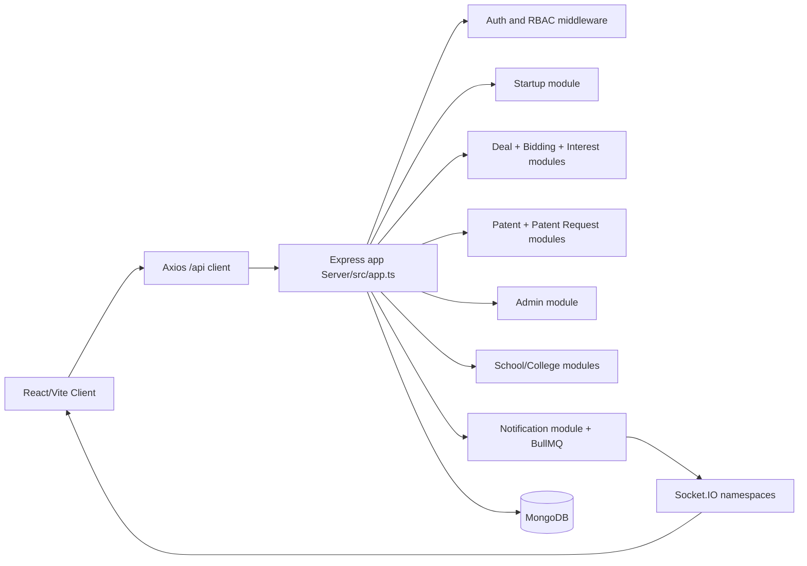

Core mounting:

- Client routes: `Client/src/pages/index.tsx`
- Sidebar navigation: `Client/src/components/layouts/dashboardNavigation.ts`
- API wrappers: `Client/src/api/*.ts`
- Server namespaces: `Server/src/app.ts`
- Role middleware: `Server/src/middleware/authenticate.ts`, `Server/src/middleware/authorize.ts`
- Models: `Server/src/modules/*/*.model.ts`, plus legacy `Server/src/models/*.js`

## 3. Role-Based Access Overview

| Role | Landing route | Main navigation | Backend authorization pattern |
|---|---|---|---|
| Student / Founder | `/dashboard/student` | Dashboard, Problem Bank, Startup, Marketplace, Events, Messages | `authorize(UserRole.STUDENT)` for startup, patents, score, workspace writes |
| Investor | `/dashboard/investor` | Dashboard, Marketplace, Pipeline, Product Workshop, Portfolio, Messages | `authorize(UserRole.INVESTOR)` for investor dashboard, startup browse, deal stage advance |
| Admin | `/dashboard/admin` | Dashboard, Problems, Access Control, Patents, Startups, Verification, Deals, Mentorship, Analytics | `router.use(authenticate, authorize(UserRole.ADMIN))` in admin routes |
| School | `/dashboard/school` | Dashboard, Students, Events, Analytics, Messages | `authorize(UserRole.SCHOOL)` |
| College | `/dashboard/college` | Dashboard, Students, Events, Placement Tracker, Analytics, Marketplace, Messages | `authorize(UserRole.COLLEGE)` |
| Mentor | `/dashboard/mentor` | Dashboard, Problem Bank, Opportunities, Student Feed, Sessions, Messages | `authorize(UserRole.MENTOR)` |
| Recruiter | `/dashboard/recruiter` | Dashboard, Marketplace, Drive, Messages | `authorize(UserRole.RECRUITER)` |

Access behavior:

```mermaid
flowchart TD
  A[User opens route] --> B{Session user exists?}
  B -- No --> C[/login]
  B -- Yes --> D{Role allowed?}
  D -- No --> E[roleRedirect(role)]
  D -- Yes --> F[Render protected page]
  F --> G{Terms accepted?}
  G -- No and non-admin --> H[TermsAcceptanceGate blocks UI]
  G -- Yes --> I[Full page access]
```

## 4. Founder Workflow

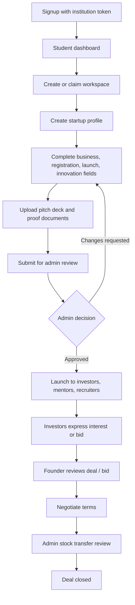

Founder pages validated:

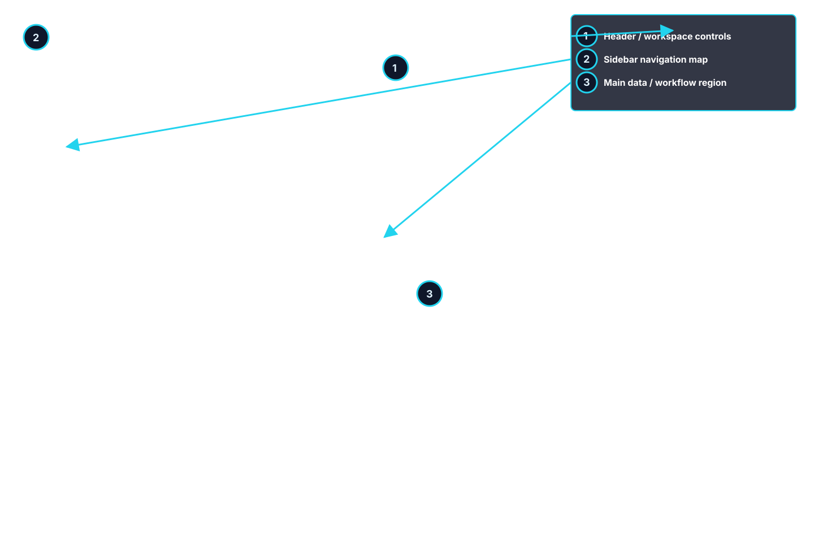

[1] Header / workspace controls  
-> Shows current route context, notification bell, invite teammate action, and account identity.  
-> Notification reads call `PATCH /api/notifications/:id/read` or `PATCH /api/notifications/read-all`.  
-> Invite teammate opens workspace invite dialog and uses workspace/request APIs.

[2] Sidebar navigation  
-> Built from `SIDEBAR_CONFIG[UserRole.STUDENT]`.  
-> Routes to dashboard, problem bank, startup launch, marketplace, events, and messages.

[3] Main dashboard region  
-> Aggregates score, workspace, startup, mentor, event, and deal data.  
-> Key APIs include `/api/users/me`, `/api/score/me`, `/api/startup/mine`, `/api/deals`.


[1] Startup list header  
-> Purpose: show every startup the student founded, co-founded, or was invited to.  
-> Data source: `startupApi.mine()` -> `GET /api/startup/mine`.

[2] Create / manage startup action  
-> Opens `/startup-launch/new` or `/startup-launch/:startupId/overview`.  
-> Only student role can create or edit startups.

[3] Startup card  
-> Displays `Startup.name`, `tagline`, `category`, `stage`, `reviewStatus`, launch flags, and funding summary.  
-> Editability comes from `buildStartupEditAccess()` in `startup.service.ts`.


[1] Startup intake form  
-> Saves through `startupApi.create()` or `startupApi.update()`.  
-> Backend schema: `startupSchema` in `Server/src/modules/startup/startup.service.ts`.

[2] Pitch deck upload  
-> Calls `POST /api/startup/:id/upload-pitch`.  
-> Stored on startup fields `pitchDeckUrl`, `pitchDeckName`, `pitchDeckStorageProvider`, `pitchDeckStorageKey`.

[3] Document proof upload  
-> Calls `POST /api/startup/:id/documents`.  
-> Stores `documents[]` with category, URL, file type, size, uploader, storage provider, and timestamps.  
-> Route upload limits: 10 MB pitch deck, 3 MB proof documents.

Startup field mapping:

| UI field | API | Backend controller/service | Database field |
|---|---|---|---|
| Startup Name | `POST/PATCH /api/startup` | `createStartup`, `patchStartup` -> `createStartupProfile`, `updateStartupProfile` | `Startup.name` |
| Tagline | `POST/PATCH /api/startup` | Startup service normalization | `Startup.tagline` |
| Category | `POST/PATCH /api/startup` | Startup service normalization | `Startup.category` |
| Stage | `POST/PATCH /api/startup` | `startupSchema.stage` | `Startup.stage` |
| Business problem | `POST/PATCH /api/startup` | `startupBusinessProfileSchema` | `Startup.businessProfile.problemStatement` |
| Registration/IP answers | `POST/PATCH /api/startup` | `startupRegistrationProfileSchema` | `Startup.registrationProfile.*` |
| Launch profile | `POST/PATCH /api/startup` | `startupInitializationProfileSchema` | `Startup.initializationProfile.*` |
| Innovation rubric | `POST/PATCH /api/startup` | `startupInnovationProfileSchema` | `Startup.innovationProfile.*` |
| Request review | `POST /api/startup/:id/request-review` | `requestStartupReviewController` | `reviewStatus=review_requested`, `reviewRequestedAt` |
| Launch target | `POST /api/startup/:id/launch` | `launchStartupController` | `launchedToInvestors`, `launchedToMentors`, `launchedToRecruiters`, `launchedAt` |

## 5. Investor Workflow

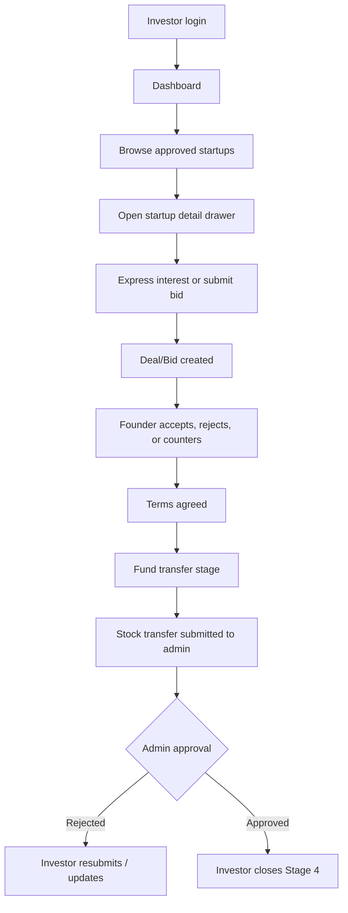


[1] Investor dashboard metrics  
-> Uses `dealApi.getInvestorDeals()` and startup/investor stats.  
-> Backend: `getInvestorDashboardStats()` counts active deals, new startups, portfolio count, and score averages.

[2] Marketplace navigation  
-> Opens `/dashboard/investor/startups`.  
-> Lists only startups with `launchedToInvestors: true` and `reviewStatus: approved`.

[3] Pipeline navigation  
-> Opens `/dashboard/investor/pipeline`.  
-> Groups deals by stage 0-4 using `DealGroupView`.


[1] Startup marketplace list  
-> API: `GET /api/investor/startups`.  
-> Backend filter: launched, approved startups only.  
-> Supports score, category, stage, penny, and sole availability filters.

[2] Startup detail drawer  
-> Shows startup detail, founder score snapshot, pitch info, and offer controls.  
-> Buttons wire into interest/deal APIs.

[3] Express Interest / Place Bid  
-> Interest path: `POST /api/interests/startup/:startupId`.  
-> Deal/bid path used by current modal: `POST /api/startups/:startupId/bid` -> `placeBid()`.


[1] Deal pipeline lanes  
-> Stage 0: intake/terms proposal.  
-> Stage 1: founder decision required.  
-> Stage 2: fund transfer.  
-> Stage 3: ProMove stock transfer review.  
-> Stage 4: closed portfolio.

[2] Negotiation panel  
-> `POST /api/deals/:dealId/negotiation-message`.  
-> `POST /api/deals/:dealId/negotiation-propose`.  
-> `POST /api/deals/:dealId/negotiation-agree`.

[3] Cancel deal  
-> `POST /api/deals/:dealId/cancel`.  
-> If the deal is admin-approved or closed, cancellation is locked or routed to admin review depending on state.

Investor field mapping:

| UI action | API | Database fields updated | Side effects |
|---|---|---|---|
| Express interest | `POST /api/interests/startup/:id` | `Interest.status=active`, `Startup.interestedInvestorCount` | Notification to founder, bid socket event |
| Withdraw interest | `DELETE /api/interests/startup/:id` | `Interest.status=withdrawn`, `withdrawnAt` | Funding/interest summary updates |
| Place penny bid | `POST /api/startups/:id/bid` | `Investment.investorType=penny`, `Bid.bidType=penny` | Founder notification, lifecycle event |
| Place sole bid | `POST /api/startups/:id/bid` | `Investment.investorType=sole`, `Bid.bidType=sole` | Sole investor constraints checked |
| Propose terms | `POST /api/deals/:id/negotiation-propose` | `Investment.negotiation.*` | Other participant notification |
| Agree terms | `POST /api/deals/:id/negotiation-agree` | `termsAgreedAt`, participant agreement flags | Stage 1 becomes available |
| Advance stage | `PATCH /api/investor/deals/:id/stage` | `Investment.stage`, `mediationStatus`, `stockTransfer`, `royalty` | Stage notifications and lifecycle events |

## 6. Admin Workflow

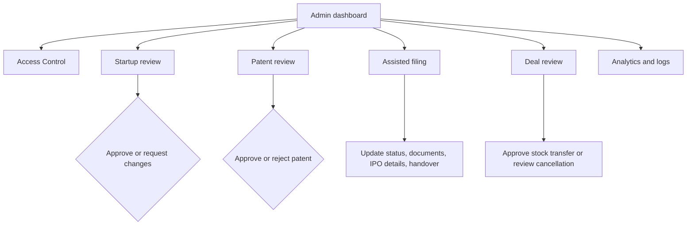


[1] Platform control center  
-> Pulls analytics, pending requests, deal load, mentorship, and problem review summaries.  
-> Main API: `adminApi.getAnalytics()` -> `GET /api/admin/analytics`.

[2] Admin sidebar  
-> Admin does not have Messages route in sidebar.  
-> Access controlled by admin route wrapper and backend admin router.

[3] Review queues  
-> Navigation routes are grouped by problems, users, patents, startups, verification, deals, mentorship, analytics.


[1] Startup review queue  
-> API: `GET /api/admin/startups?status=review_requested`.  
-> Shows submitted startup profiles with evidence and admin notes.

[2] Approve button  
-> `PATCH /api/admin/startups/:startupId/review` with `decision: approved`.  
-> Updates `Startup.reviewStatus=approved`, `adminReviewedAt`, `adminReviewedBy`, `adminNotes`.  
-> Startup can then launch to investors/mentors/recruiters.

[3] Request changes button  
-> Same endpoint with `decision: changes_requested`.  
-> Requires admin notes length >= 10.  
-> Founder receives notification and DM-style message via `notifyFoundersAboutStartupChangeRequest()`.


[1] Direct patent queue  
-> API: `GET /api/admin/patents`.  
-> Model: `Patent` with `status=submitted|under_review|approved|rejected`.

[2] Approve patent  
-> `PATCH /api/admin/patents/:id/approve`.  
-> Updates patent review fields and may apply patent score through score engine according to current scoring policy.

[3] Reject patent  
-> `PATCH /api/admin/patents/:id/reject`.  
-> Requires rejection/admin notes and stores `adminNotes`.


[1] Assisted filing case list  
-> API: `GET /api/admin/patent-requests`.  
-> Model: `PatentRequest` with formal filing fields, timelines, document review statuses, and deadlines.

[2] Case detail modal  
-> Allows status transitions, IPO details, document review, notes, conversation, and official handover.

[3] Handover controls  
-> `POST /api/admin/patent-requests/:id/handover/documents`.  
-> `PATCH /api/admin/patent-requests/:id/handover`.  
-> Student confirms with `PATCH /api/patents/requests/:id/handover/acknowledge`.


[1] Deal overview  
-> API: `GET /api/admin/deals`.  
-> Shows active mediation, stock transfer requests, royalty status, and stage state.

[2] Approve stage  
-> `PATCH /api/admin/deals/:dealId/approve-stage`.  
-> Sets `adminApprovedAt`, `adminApprovedBy`, `adminApprovalRequired=false`, stock transfer approval fields.

[3] Review cancellation  
-> `PATCH /api/admin/deals/:dealId/cancellation`.  
-> Decides pending cancellation requests after admin-controlled states.

## 7. Complete UI Walkthrough

### Public and Auth Screens

[1] Landing page  
-> Route `/`.  
-> Public only. Authenticated users are redirected by `roleRedirect()`.

[2] Login  
-> Route `/login`.  
-> Form fields: email, password.  
-> API: `POST /api/auth/login`.  
-> Stores current user in Zustand session storage under `promove-auth-user`; token is kept in runtime state and refreshed with cookie-based refresh.

[3] Signup  
-> Route `/signup`.  
-> Student registration calls `POST /api/auth/register`.  
-> Non-student access requests call `POST /api/auth/register-request` and enter admin approval.

[4] Request access  
-> Route `/request-access`.  
-> For school/college/mentor/investor/recruiter.  
-> School/college require institution profile and verification packet.

### Student / Founder Screens

[1] Dashboard  
-> Purpose: operational overview for innovation score, workspaces, startup/deal status, and activity.

[2] Problem Bank  
-> Lists problems, claim workflow, project workspace, review submission, and score integration.

[3] Startup  
-> Create startup, upload pitch/proofs, request review, launch, view bids, cap table, outreach, patent support.

[4] Marketplace  
-> Student sees jobs and ecosystem listings.

[5] Messages  
-> Shared DM surface. Admin is intentionally excluded from shared messages.

### Investor Screens

[1] Dashboard  
-> Metrics and shortcuts.

[2] Marketplace  
-> Approved startup browsing and filtering.

[3] Pipeline  
-> Deal stages and negotiation tracking.

[4] Product Workshop  
-> Investor-linked workspace/product collaboration after access is granted.

[5] Portfolio  
-> Redirects to portfolio surface.

### Admin Screens

[1] Problems  
-> Problem library and problem review requests.

[2] Access Control  
-> Registration requests, institution compliance packets, user directory, role/access/delete actions.

[3] Patents  
-> Direct patent review plus assisted filing workspace.

[4] Startups  
-> Startup admin review queue.

[5] Verification  
-> Startup/investor fraud and verification panel.

[6] Deals  
-> Stage approval, stock transfer review, cancellation review, register.

[7] Analytics  
-> Operational overview, usage, users, logs, platform analytics.

### Institution Screens


[1] Institution command center  
-> School data API: `/api/school/dashboard`.  
-> College data API: `/api/college/dashboard`.

[2] Student leaderboard / roster  
-> School: `/api/school/students`, `/api/school/student-roster`.  
-> College: `/api/college/students`, `/api/college/student-roster`.

[3] Compliance and analytics  
-> Policy submissions and evidence are reviewed by admin through `/api/admin/compliance-submissions`.


[1] Placement tracker  
-> API: `/api/college/placement`.  
-> Recruiter connections and hiring applications map to recruiter module records.

[2] Student placement status  
-> Updates call college placement endpoints and recruiter application workflows.

[3] Events and marketplace  
-> College can invite recruiters, manage events, and browse marketplace.

## 8. Screenshot Annotation Guide

Captured screenshots are stored in `docs/visual-user-manual/screenshots/`. Annotated SVG overlays are stored next to this README.

| Screen | Annotated asset | Primary role | Purpose |
|---|---|---|---|
| Student dashboard | `student-dashboard.annotated.svg` | Student | Founder overview |
| Startup list | `startup-list.annotated.svg` | Student | Startup inventory |
| Startup create | `startup-create.annotated.svg` | Student | Startup intake |
| Patent support | `patent-support.annotated.svg` | Student | Direct patent or assisted filing |
| Student marketplace | `student-marketplace.annotated.svg` | Student | Jobs/ecosystem marketplace |
| Investor dashboard | `investor-dashboard.annotated.svg` | Investor | Investor overview |
| Investor startups | `investor-startups.annotated.svg` | Investor | Startup discovery |
| Investor pipeline | `investor-pipeline.annotated.svg` | Investor | Deal stages |
| Investor product workshop | `investor-product-workshop.annotated.svg` | Investor | Workspace collaboration |
| Admin dashboard | `admin-dashboard.annotated.svg` | Admin | Control center |
| Admin startups | `admin-startups.annotated.svg` | Admin | Startup moderation |
| Admin patents | `admin-patents.annotated.svg` | Admin | Direct patent moderation |
| Admin assisted filing | `admin-assisted-filing.annotated.svg` | Admin | Patent request operations |
| Admin deals | `admin-deals.annotated.svg` | Admin | Deal review |
| Admin users | `admin-users.annotated.svg` | Admin | Access control |
| Admin analytics | `admin-analytics.annotated.svg` | Admin | Platform analytics |
| School dashboard | `school-dashboard.annotated.svg` | School | Institution overview |
| School students | `school-students.annotated.svg` | School | Student roster/leaderboard |
| College dashboard | `college-dashboard.annotated.svg` | College | Institution overview |
| College placement | `college-placement.annotated.svg` | College | Placement tracker |

Universal callout key:

[1] Header and workspace controls  
-> Navigation label, notification actions, user identity, workspace invite.

[2] Sidebar navigation  
-> Role-specific route list from `SIDEBAR_CONFIG`.

[3] Main data/workflow region  
-> Page-specific cards, tables, forms, modals, and action buttons.

## 9. API and Database Mapping

### Auth and User

| UI | API | Backend | DB |
|---|---|---|---|
| Login form | `POST /api/auth/login` | `auth.controller.login` -> `loginUser()` | `User.email`, `passwordHash`, `lastLogin`, refresh token |
| Student signup | `POST /api/auth/register` | `registerUser()` | `User.role=student`, `institutionToken`, `adminApprovalStatus` |
| Non-student access request | `POST /api/auth/register-request` | `submitRegistrationRequest()` | `User.adminApprovalStatus=pending`, institution verification fields |
| Terms acceptance | `POST /api/users/me/terms-acceptance` | `acceptTermsSchema` -> user service | `User.termsAcceptance` |
| Profile edit | `PATCH /api/users/me` | `updateMeSchema` | `User.displayName`, social links, portfolio fields |

### Startup

| UI | API | Backend | DB |
|---|---|---|---|
| Startup list | `GET /api/startup/mine` | `getMyStartupsController` | `Startup.founderIds`, `teamMemberIds` |
| Create startup | `POST /api/startup` | `createStartupProfile()` | `Startup` document |
| Edit startup | `PATCH /api/startup/:id` | `updateStartupProfile()` | startup profile fields |
| Upload pitch | `POST /api/startup/:id/upload-pitch` | `uploadPitchController` | `pitchDeck*` fields |
| Upload proof | `POST /api/startup/:id/documents` | `uploadStartupDocumentController` | `documents[]` |
| Submit review | `POST /api/startup/:id/request-review` | `requestStartupReviewController` | `reviewStatus`, `reviewRequestedAt` |
| Admin review | `PATCH /api/admin/startups/:id/review` | `reviewStartupController` | `adminReviewedAt`, `adminReviewedBy`, `adminNotes` |
| Launch | `POST /api/startup/:id/launch` | `launchStartup()` | launch flags, locked launch form |
| Timeline | `GET /api/startup/:id/timeline` | lifecycle module | `StartupLifecycleEvent` |

### Interest, Bid, Deal

| UI | API | Backend | DB |
|---|---|---|---|
| Express interest | `POST /api/interests/startup/:id` | `expressInterest()` | `Interest`, startup counts |
| Place bid | `POST /api/startups/:id/bid` | `placeBid()` in deal service | `Investment`, `Bid` |
| Bid board | `GET /api/startups/:id/bids` | deal/bid board | `Bid`, `Investment` |
| Founder decision | `PATCH /api/deals/:id/founder-decision` | `recordFounderDecision()` | `Investment.founderDecision` |
| Negotiation message | `POST /api/deals/:id/negotiation-message` | deal service | `Investment.negotiation.messages[]` |
| Propose terms | `POST /api/deals/:id/negotiation-propose` | `NegotiationTermsSchema` | `negotiation.*Amount`, `*Equity` |
| Agree terms | `POST /api/deals/:id/negotiation-agree` | agreement logic | `negotiation.termsAgreedAt` |
| Advance investor stage | `PATCH /api/investor/deals/:id/stage` | `advanceDealStage()` | `Investment.stage`, stock/royalty fields |
| Admin approve stage | `PATCH /api/admin/deals/:id/approve-stage` | admin service | `adminApprovedAt`, stock approval |
| Cancel deal | `POST /api/deals/:id/cancel` | `cancelDealByParticipant()` | `status`, `cancellationRequest`, `negotiation.status` |

### Patent and Privacy

| UI | API | Backend | DB |
|---|---|---|---|
| Direct patent submit | `POST /api/patents/submit` | `submitPatent()` | `Patent` |
| My patents | `GET /api/patents/mine` | patent controller | `Patent.studentId` |
| Showcase patent | `PATCH /api/patents/:id/showcase` | `showcasePatent()` | `showcasedInMarketplace` |
| Assisted filing create | `POST /api/patents/requests` | `createPatentSupportRequest()` | `PatentRequest` |
| Formal assisted filing | `POST /api/patents/requests/submit` | `submitPatentRequest()` | formal patent request fields |
| Upload request docs | `POST /api/patents/requests/:id/documents` | document upload service | `PatentRequest.documents[]` |
| Student/admin messages | `/api/patents/requests/:id/messages` and admin equivalent | patent conversation service | `PatentConversationMessage` |
| Admin status update | `PATCH /api/admin/patent-requests/:id/status` | admin request service | `PatentRequest.status`, timeline |
| Handover | `PATCH /api/admin/patent-requests/:id/handover` | admin request service | `officialHandover` |

## 10. State Transition Documentation

### Startup Review Status

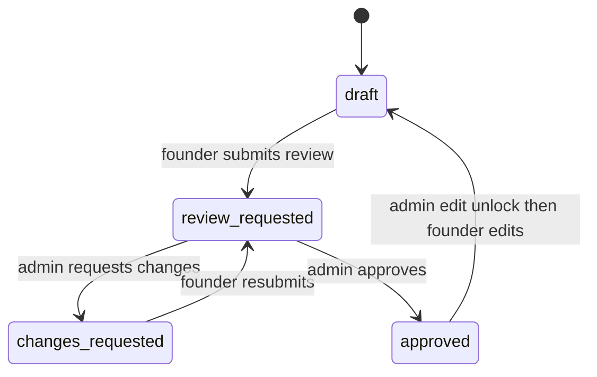

Locks:

- `review_requested` and `approved` lock profile edits unless `adminEditUnlockActive` is true.
- Launch form locks after launch unless admin unlocks it.
- `changes_requested` reopens edits so founder can revise and submit again.

### Startup Launch Visibility

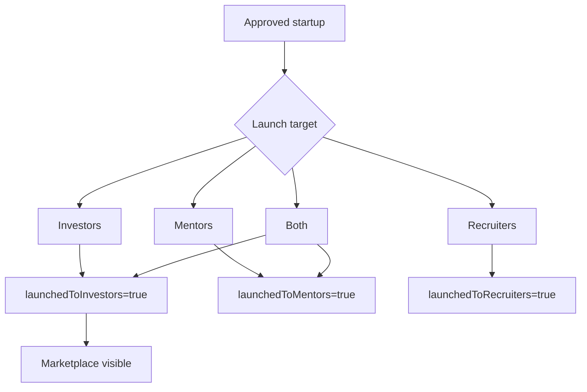

### Bid Status

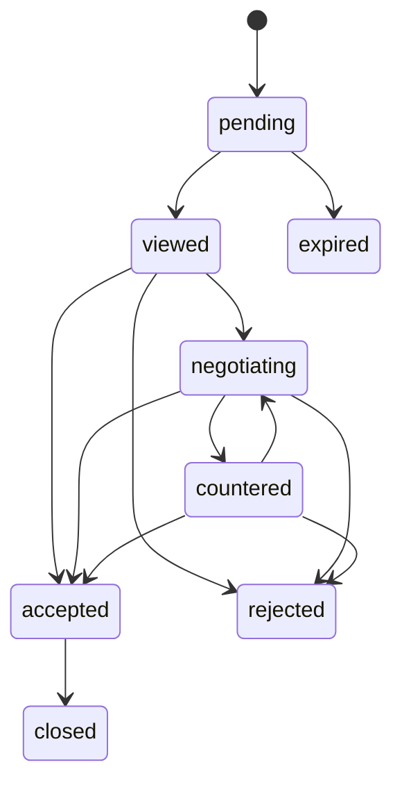

### Deal Stage

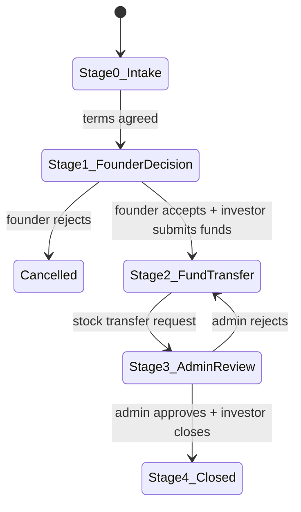

### Patent Request Status

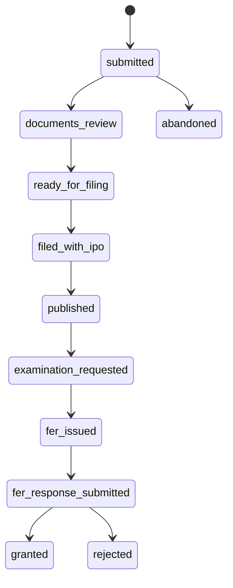

## 11. Notification System

```mermaid
flowchart LR
  Action[User/admin action] --> Queue[BullMQ notificationQueue]
  Queue --> Worker[notificationWorker]
  Worker --> DB[(Notification)]
  Worker --> Socket[/notifications socket]
  Socket --> Client[Notification bell]
```

Notification model:

- `userId`
- `type`: `score_update`, `team_invite`, `chat_invite`, `request`, `patent_status`, `deal_interest`, `startup_launch`, `system`
- `title`, `body`, `link`, `metadata`
- `isRead`

Common triggers:

- Startup launch -> target investors/mentors/recruiters.
- Startup changes requested -> founder notification plus DM-style message.
- Interest/bid placed -> founder notification.
- Bid countered/accepted/rejected/expired -> participant notification.
- Deal stage moved -> founder notification.
- Patent submitted/status/document/handover -> student/admin notification.
- Recruiter shortlist/job/application/hiring events -> student/recruiter/institution notifications.

## 12. Deal Pipeline Explanation

[1] Interest is lightweight  
-> `Interest` records only active/withdrawn investor interest.  
-> Used for discovery and gating some bid flows.

[2] Bid is negotiation-facing  
-> `Bid` tracks pending/viewed/negotiating/countered/accepted/rejected/expired/closed state.  
-> Contains proposed/counter/final amount and equity.

[3] Investment is the deal ledger  
-> `Investment` stores authoritative stage, negotiation, stock transfer, royalty, founder decision, cancellation, and final status.

[4] Admin stage approval is required before closing  
-> Stage 3 sets `adminApprovalRequired=true`.  
-> Admin approves stock transfer before Stage 4 close.

[5] Equity rules enforced server-side  
-> Minimum investment: INR 20,000.  
-> Penny investor max: 5% each, 49% collective.  
-> Sole director requires at least 51%.  
-> Total investor equity cannot exceed 100%.  
-> Shares allocated cannot exceed available shares.

## 13. Patent and Privacy System

Direct patent path:

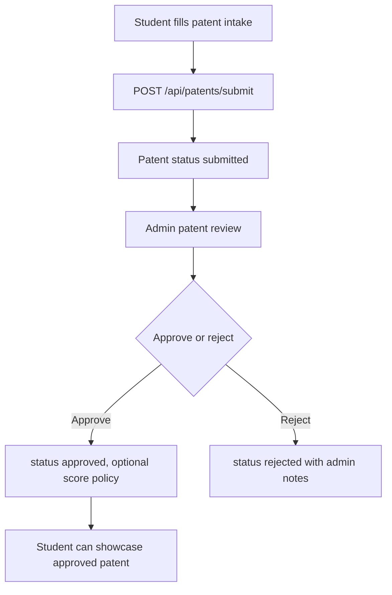

Assisted filing path:

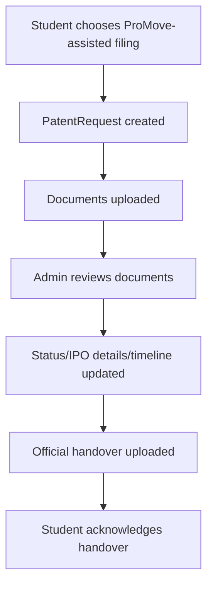

Privacy notes:

- Patent supporting documents and startup proof documents are not public by default.
- Startup marketplace visibility depends on admin approval and launch flags.
- Patent showcase requires approved patent and student toggle.
- Admin-only fields include internal notes, review metadata, handover operations, and IPO management.
- The codebase does not show explicit NDA gating for investor patent access in the current visible flow; treat NDA-before-access as a policy gap unless implemented elsewhere.

## 14. Business Logic Breakdown

### Bidding

- Investor must not be a founder of the same startup.
- Approved/launched startup is required.
- Current `bidding.service.ts` requires active interest before placing a bid, while the newer deal modal uses `/api/startups/:id/bid` directly through deal service. This is a contract split to monitor.
- Bids expire after configured windows and notify investor.
- Sole bid acceptance closes other sole bids and marks startup exclusive.

### Deal Negotiation

- Participants can send messages, propose terms, and agree terms.
- Stage 1 requires agreed terms.
- Stage 2 requires founder acceptance and minimum fund amount.
- Stage 3 requests admin review.
- Stage 4 requires admin approval.

### Investor Matching and Ranking

- Startup marketplace filters approved launched startups by score, category, stage, and availability.
- `trendingScore`, `innovationScoreAtLaunch`, funding fields, and launch timestamps drive discoverability surfaces.
- Investor authority derives from investor type, equity, and selected role.

### Startup Ranking

- Startup innovation rubric data lives in `Client/src/features/startup/innovationRubric.ts` and startup service scoring/normalization.
- Startup launch stores `innovationScoreAtLaunch`.
- Funding progress and investor counts are recomputed from deals/interests.

### Admin Moderation

- Startup approval controls marketplace eligibility.
- Patent approval controls patent status and showcase eligibility.
- Deal approval controls closing of stock transfer workflow.
- User/admin approval controls access for non-student roles.

## 15. Technical Dependency Mapping

| System | Client files | Server files | Tests |
|---|---|---|---|
| Auth/RBAC | `features/auth/*`, `store/authStore.ts`, `hooks/useProtectedRoute.ts` | `modules/auth/*`, `middleware/authenticate.ts`, `middleware/authorize.ts` | `Server/tests/integration/auth.test.ts` |
| Startup launch | `app/pages/StartupLaunch.tsx`, `features/startup/*`, `api/startup.api.ts` | `modules/startup/*`, `modules/startupLifecycle/*` | `startupRoutes.test.ts`, `startupReview.test.ts` |
| Investor marketplace | `features/investor/*`, `features/marketplace/*`, `api/marketplace.api.ts` | `modules/investor/*`, `modules/marketplace/*` | `marketplaceAccess.test.ts` |
| Interest/bids/deals | `api/interest.api.ts`, `api/bidding.api.ts`, `api/deal.api.ts`, `features/bidding/*` | `modules/interest/*`, `modules/bidding/*`, `modules/deal/*` | `investments.test.ts` |
| Patents | `app/pages/PatentSupport.tsx`, `features/admin/Patents.tsx`, `PatentRequests.tsx` | `modules/patent/*` | `patentSubmission.test.ts`, `patentSupportRequest.test.ts`, `adminPatent.test.ts` |
| Notifications | `hooks/useNotifications.ts`, dashboard layout bell | `modules/notification/*`, `jobs/notificationWorker.ts`, `sockets/notificationSocket.ts` | indirect integration tests |
| Institutions | `features/school/*`, `features/college/*`, `api/school.api.ts`, `api/college.api.ts` | `modules/school/*`, `modules/college/*`, `modules/institution/*` | `institutionPolicySubmission.test.ts`, `collegePlacement.test.ts` |
| Settings | `features/settings/SettingsPage.tsx`, `api/settings.api.ts` | `modules/settings/*` | `settings.test.ts` |

## 16. Missing Feature Analysis

Code-backed gaps or risks found during this manual pass:

[1] NDA before investor patent access is not visible as an enforced route/model gate  
-> The current patent and startup document flows protect visibility by role/status, but no explicit NDA acceptance model or API gate was identified for investor access to confidential patent files.

[2] Bidding contract split  
-> `bidding.service.ts` enforces active interest before bid placement.  
-> `dealApi.placeBid()` uses `/api/startups/:startupId/bid`, backed by deal service, which creates `Investment` plus `Bid`.  
-> Documented workflows should treat the deal service path as the active investor modal path, but engineering should keep both paths aligned.

[3] Investor browser console errors  
-> Browser capture passed, but investor screens emitted repeated HTTP 400 resource errors and Recharts container width/height warnings.  
-> This did not block rendering screenshots, but should be investigated before production demos.

[4] Assisted patent filing uses many legal fields but not all UI states explain legal consequences  
-> The manual clarifies Form 1/2/3/5/26/28 fields, but user-facing copy should ensure students understand official filing implications.

[5] Some documentation/visuals are representative, not exhaustive video-level captures  
-> This manual captures the main role screens and code maps all major modules. Nested modals such as every admin case tab and every negotiation modal are documented by callout and API mapping, not every modal state screenshot.

## 17. Suggested Improvements

[1] Add a first-class NDA/access ledger  
-> Model: `ConfidentialAccessGrant` with investorId, startupId, documentId, acceptedNdaVersion, grantedAt, revokedAt.  
-> Gate patent/startup sensitive file APIs through this model.

[2] Unify bidding/deal creation contract  
-> Pick one path for investor offer creation.  
-> If `/api/startups/:startupId/bid` is canonical, move interest-required rules there or explicitly document direct-offer behavior.

[3] Add admin-visible workflow health panel  
-> Show stalled startup reviews, expired bids, pending patent docs, pending stock transfer review, and failed notification jobs.

[4] Add screenshot callout IDs in the app for support  
-> Use `data-manual-id` attributes on critical buttons.  
-> This makes future manuals and Playwright tests stable.

[5] Add API event catalog  
-> Keep notification types, lifecycle event types, and activity log action names in a single exported registry.

## 18. Final System Blueprint

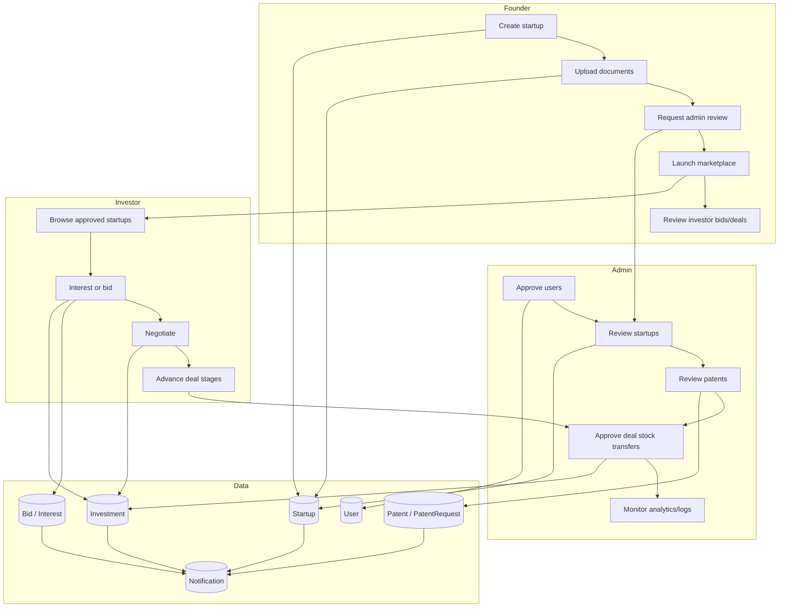

Operational rule:

> A startup becomes investable only after the founder completes the startup record, submits it for admin review, the admin approves it, and the founder launches it to investors.

Deal rule:

> A deal becomes closed only after participant terms are agreed, founder acceptance is recorded, fund transfer is started, admin approves the stock transfer stage, and the investor advances the deal to Stage 4.

Patent rule:

> Direct patent submissions and assisted filing requests stay in protected student/admin workflows until reviewed, approved, showcased, handed over, or acknowledged according to their respective status models.

## Validation Appendix

Browser path:

- Browser plugin availability: not available in this session.
- Fallback: Playwright Chromium.
- App URL: `http://localhost:5173`.
- API health: `http://localhost:5000/health`.
- Viewport: 1440 x 960.
- Result: 5 role capture tests passed.

Screens captured:

- Student: dashboard, startup list, startup create, patent support, marketplace.
- Investor: dashboard, startups, pipeline, product workshop.
- Admin: dashboard, startups, patents, assisted filing, deals, users, analytics.
- School: dashboard, students.
- College: dashboard, placement.

Console findings:

- Student and school runs showed transient Socket.IO WebSocket close warnings after navigation.
- Investor run showed repeated HTTP 400 resource errors and chart dimension warnings.
- Admin and college runs had no captured console errors.

