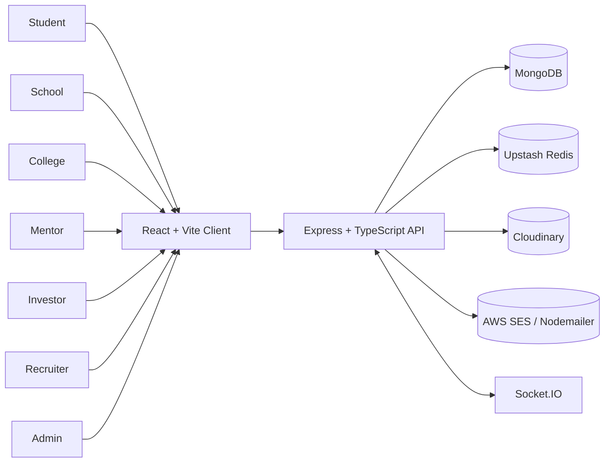
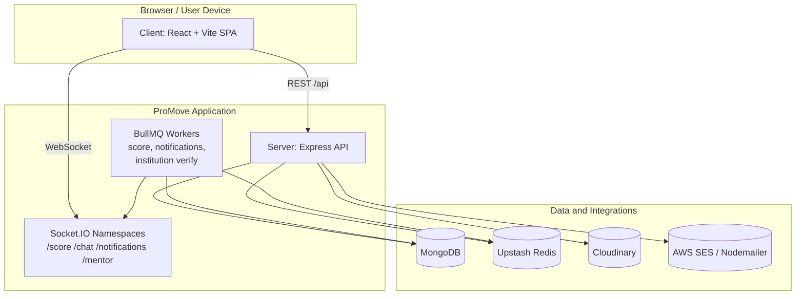
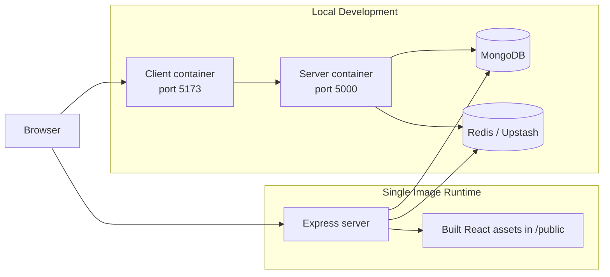
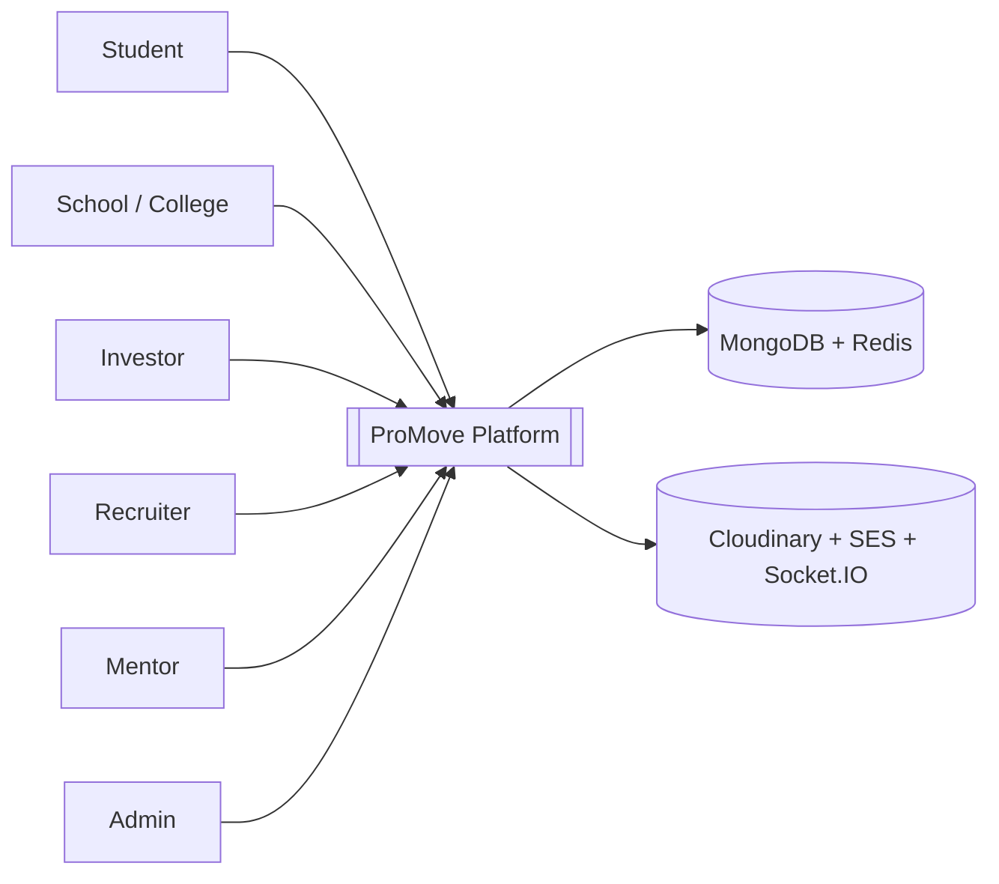
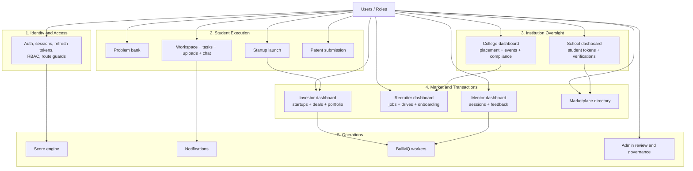
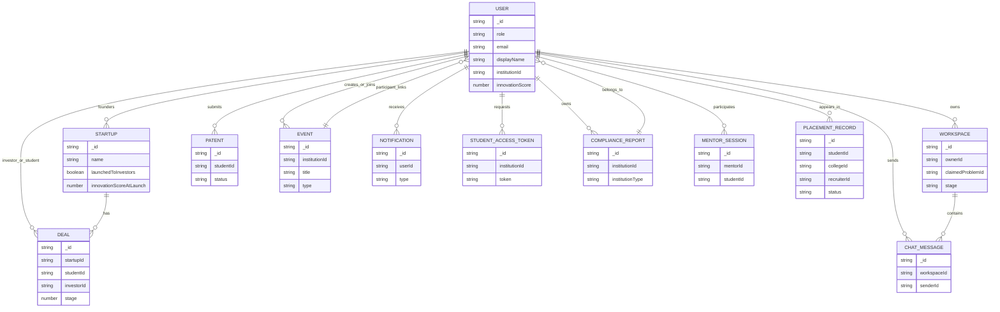
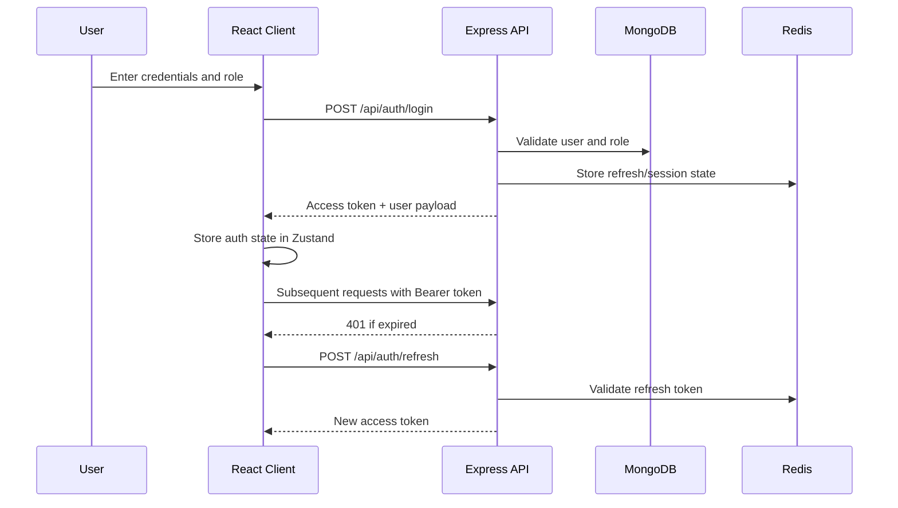
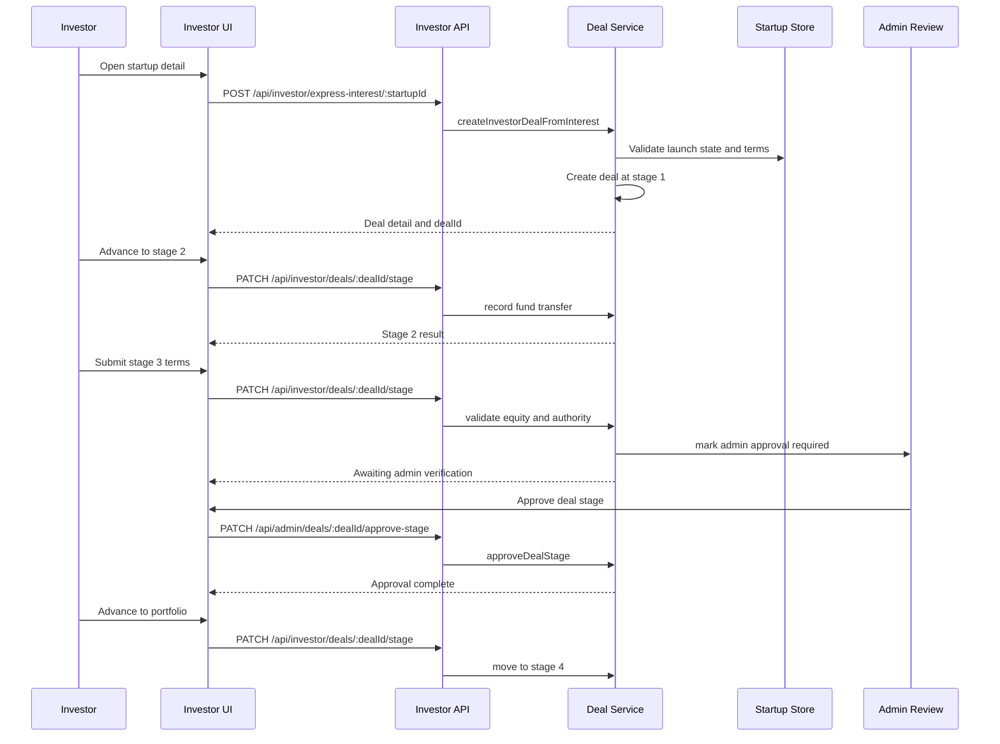
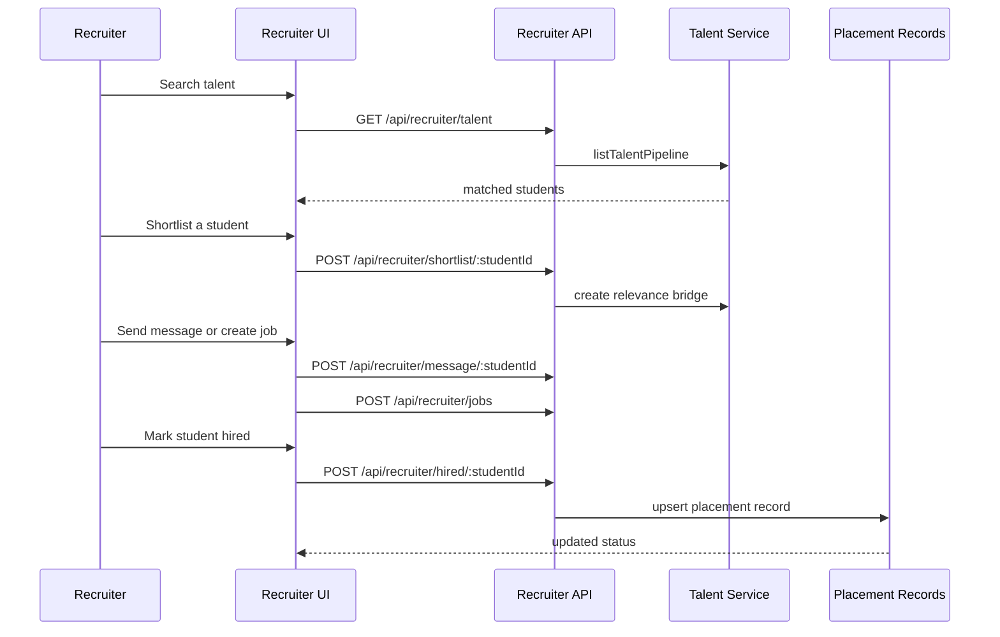
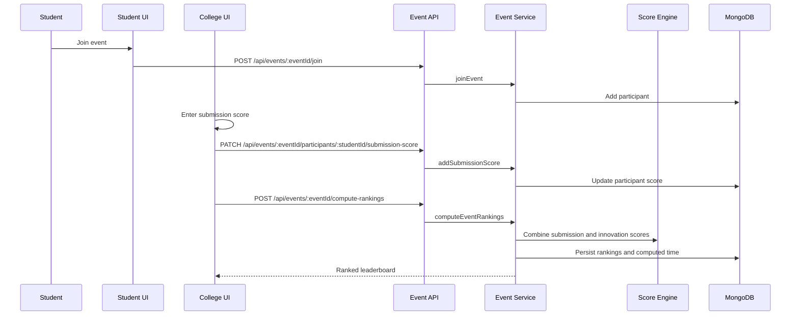

# ProMove Architecture Diagrams

This document captures the current implementation of ProMove as it exists in the repo today.

## Scope Notes

- Active backend is the TypeScript/Express application under `Server/src`.
- Active frontend is the React/Vite application under `Client/src`.
- Legacy JavaScript modules in `Server/src/modules/board`, `project`, `sprint`, `student`, `team`, `ticket`, and `upload` are archived code paths and are not part of the mounted API in `Server/src/app.ts`.
- The frontend also contains a transitional `src/app/*` tree alongside the active feature-based `src/features/*` tree.

## 1. System Context

This view shows the primary actors and the core platform services they touch.

## 2. Container Diagram

This is the runtime decomposition used by the repo.

## 3. Deployment Diagram

This reflects the current local compose setup and the root Docker image flow.

## 4. DFD Level 0

The level 0 view treats ProMove as a single platform with role-based inputs and shared platform outputs.

## 5. DFD Level 1

This breaks the platform into the active domain flows mounted in `app.ts`.

## 6. ER Diagram

This ER-style view focuses on the current persisted entities and their main relationships.

## 7. Auth Sequence

## 8. Investor Deal Flow

## 9. Recruiter Hiring Sequence

## 10. Event Ranking Sequence

## 11. Notes

- Active frontend source of truth is `Client/src/features`, `Client/src/api`, `Client/src/components`, and `Client/src/pages`.
- Active backend source of truth is `Server/src/app.ts`, `Server/src/server.ts`, `Server/src/modules`, `Server/src/config`, `Server/src/jobs`, `Server/src/workers`, and `Server/src/sockets`.
- `temp/`, exported Postman JSON, Newman outputs, and local audit artifacts are generated/derived and should not be treated as canonical architecture sources.
- The repo still contains older JS module families in the backend and a transitional page-based scaffold in the frontend. Those are important for historical context, but the diagrams above reflect the currently mounted implementation.
