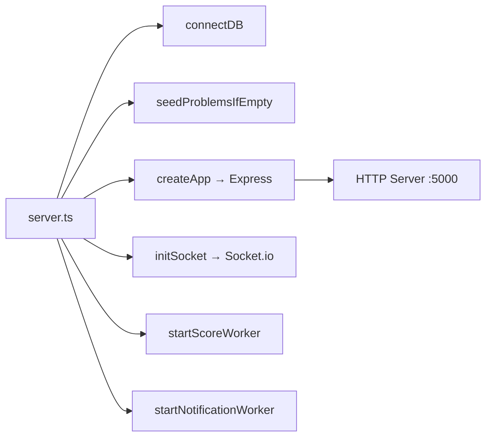
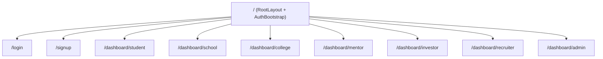

# ProMove — Complete Repository Analysis

## 1. Overview

**ProMove** is a student-first innovation platform connecting **7 roles** (Student, School, College, Investor, Mentor, HR, Superadmin) in a unified workflow spanning project execution, mentorship, investing, hiring, and marketplace transactions.

The codebase is a **monorepo** with two main packages:

| Package | Path | Stack |
|---------|------|-------|
| **Client** | `Client/` | React 18 · Vite · TypeScript · TailwindCSS · Zustand · React Query · Socket.io-client |
| **Server** | [Server/](file:///c:/Charan%20Works/Other%20Projects/ProMove/Server/src/server.ts#10-26) | Express 5 · TypeScript · Mongoose · Redis/Upstash · BullMQ · Socket.io · Winston · Cloudinary |

Orchestration: **Docker Compose** ([docker-compose.yml](file:///c:/Charan%20Works/Other%20Projects/ProMove/docker-compose.yml)) exposes Server on `:5000` and Client on `:5173`.

---

## 2. Tech Stack Deep Dive

### Client

| Concern | Library |
|---------|---------|
| Framework | React 18 + Vite 5 |
| Routing | React Router v6 (`createBrowserRouter`) |
| Server State | TanStack React Query v5 |
| Client State | Zustand v5 |
| Forms | React Hook Form + Zod resolvers |
| HTTP | Axios (custom instance with interceptors) |
| Real-time | Socket.io-client |
| Styling | TailwindCSS 3 + `clsx` + `tailwind-merge` |
| Icons | Lucide React |
| PDF Export | jsPDF + html2canvas |

### Server

| Concern | Library |
|---------|---------|
| Framework | Express 5 |
| Database | MongoDB via Mongoose 8 |
| Auth | JWT (`jsonwebtoken`) + bcrypt |
| Caching/Queue | Redis (ioredis + @upstash/redis) + BullMQ |
| File Storage | Cloudinary (via `multer` + `streamifier`) |
| Email | Nodemailer + AWS SES |
| Security | Helmet · CORS · cookie-parser · rate limiting (@upstash/ratelimit) |
| Logging | Winston + Morgan |
| PDF Gen | PDFKit |
| Real-time | Socket.io |
| Validation | Zod |
| Testing | Jest + Supertest + mongodb-memory-server |

---

## 3. Server Architecture

### 3.1 Entry Point Flow

### 3.2 Models (16 Mongoose Schemas)

| Model | Description |
|-------|-------------|
| `User` | Core identity: name, email, password (hashed), role, isVerified, institutionId |
| `StudentProfile` | Extended student data |
| `SchoolProfile` | School institution profile |
| `CollegeProfile` | College institution profile |
| `MentorProfile` | Mentor-specific data |
| `HrProfile` | HR/recruiter profile |
| `InvestorProfile` | Investor profile |
| `Project` | Title, team, status, marketplace listing, pitch requests, files, tags |
| `Team` | Team membership and roles |
| `Board` | Jira-style board linked to projects |
| `Sprint` | Sprint planning |
| `Ticket` | Task tracking with priority (P0–P3) and status workflow |
| `Event` | Workshops, bootcamps, hackathons, campus drives |
| `Notification` | In-app notification store |
| `ActionToken` | Email verification / password reset tokens |
| `RefreshToken` | JWT refresh token records |

### 3.3 Modules (17 Feature Domains)

Each module follows a **controller → service → routes** pattern:

| Module | Files | Language |
|--------|-------|----------|
| `auth` | controller, routes, schema, service | TypeScript |
| [board](file:///c:/Charan%20Works/Other%20Projects/ProMove/Client/src/pages/index.tsx#40-57) | controller, routes, service | JavaScript |
| `chat` | controller, model, routes, types | TypeScript |
| `innovationScore` | controller, model, routes, types | TypeScript |
| `marketplace` | controller, routes, service | TypeScript |
| `notification` | controller, model, routes, service | TypeScript |
| `patent` | controller, model, routes, service, types | TypeScript |
| `problemBank` | controller, model, routes, service, types | TypeScript |
| `project` | controller, routes, service | JavaScript |
| `sprint` | controller, routes, service | JavaScript |
| `startup` | controller, model, routes, service, types | TypeScript |
| `student` | controller, routes, service | JavaScript |
| `team` | controller, routes, service | JavaScript |
| `ticket` | controller, routes, service | JavaScript |
| `upload` | controller, routes | TypeScript |
| `user` | controller, model, routes, service, types | TypeScript |
| `workspace` | controller, routes, service, types | TypeScript |

### 3.4 API Routes (10 Groups)

All mounted under `/api`:

| Route | Module |
|-------|--------|
| `/api/auth` | Registration, login, refresh, logout, verify email, reset password |
| `/api/users` | User profile CRUD |
| `/api/score` | Innovation score & leaderboards |
| `/api/problems` | Problem bank (seeded on startup) |
| `/api/workspace` | Workspace management |
| `/api/chat` | Real-time chat |
| `/api/patents` | Patent submissions & approvals |
| `/api/startup` | Startup lifecycle |
| `/api/marketplace` | Project listings & transactions |
| `/api/notifications` | Notification CRUD |
| `/api/health` | Health check |

### 3.5 Middleware

| Middleware | Purpose |
|-----------|---------|
| [authenticate.ts](file:///c:/Charan%20Works/Other%20Projects/ProMove/Server/src/middleware/authenticate.ts) | JWT verification, attaches `req.user` |
| [authorize.ts](file:///c:/Charan%20Works/Other%20Projects/ProMove/Server/src/middleware/authorize.ts) | Role-based access control (RBAC) |
| [connectionGuard.ts](file:///c:/Charan%20Works/Other%20Projects/ProMove/Server/src/middleware/connectionGuard.ts) | WebSocket connection authentication |
| [errorHandler.ts](file:///c:/Charan%20Works/Other%20Projects/ProMove/Server/src/middleware/errorHandler.ts) | Centralized error formatting + logging |
| [rateLimiter.ts](file:///c:/Charan%20Works/Other%20Projects/ProMove/Server/src/middleware/rateLimiter.ts) | Upstash-backed rate limiting |
| [validate.js](file:///c:/Charan%20Works/Other%20Projects/ProMove/Server/src/middleware/validate.js) | Zod schema validation |

### 3.6 RBAC System

**7 Roles** with a fine-grained permission map (~50+ permissions):

- **Student**: project CRUD, team management, board/ticket access, marketplace listing, pitch, mentor request
- **School**: student upload/verify, events, mentor invites
- **College**: all of School + hackathons, investor onboarding, marketplace promotion
- **Investor**: project read, pitch response/scheduling, board read
- **HR**: student search, campus drives, interview scheduling
- **Mentor**: assigned project/board access, mentor bids
- **Superadmin**: wildcard (`*`)

### 3.7 WebSocket Namespaces

| Namespace | Purpose |
|-----------|---------|
| `/score` | Real-time innovation score updates |
| `/chat` | Workspace chat messaging |
| `/notification` | Live notification delivery |

All connections are authenticated via `connectionGuard` middleware.

### 3.8 Background Jobs (BullMQ)

| Worker | Job |
|--------|-----|
| `scoreRecalcWorker` | Processes `apply-score` jobs from the score queue |
| `notificationWorker` | Dispatches notifications asynchronously |

### 3.9 Services

| Service | Purpose |
|---------|---------|
| [scoreEngine.ts](file:///c:/Charan%20Works/Other%20Projects/ProMove/Server/src/services/scoreEngine.ts) | Innovation scoring engine (10 score triggers, max score 200, Redis leaderboards, real-time emission) |
| [cloudinaryService.ts](file:///c:/Charan%20Works/Other%20Projects/ProMove/Server/src/services/cloudinaryService.ts) | File upload to Cloudinary |
| [emailService.ts](file:///c:/Charan%20Works/Other%20Projects/ProMove/Server/src/services/emailService.ts) | Email dispatch via Nodemailer/SES |

### 3.10 Testing

- **Framework**: Jest + Supertest + `mongodb-memory-server`
- **Existing tests**: 1 integration test file ([auth.test.ts](file:///c:/Charan%20Works/Other%20Projects/ProMove/Server/tests/integration/auth.test.ts))
- **Test setup**: [setup.ts](file:///c:/Charan%20Works/Other%20Projects/ProMove/Server/src/tests/setup.ts) configures in-memory MongoDB
- **Run**: `npm test` in Server directory

---

## 4. Client Architecture

### 4.1 Entry Point

[main.tsx](file:///c:/Charan%20Works/Other%20Projects/ProMove/Client/src/main.tsx) → mounts `<App />` wrapped in `QueryClientProvider` (React Query) and `StrictMode`.

### 4.2 Routing ([pages/index.tsx](file:///c:/Charan%20Works/Other%20Projects/ProMove/Client/src/pages/index.tsx))

- **Public routes**: `/login`, `/signup` (redirect away if authenticated)
- **Protected routes**: `/dashboard/{role}` — each guarded by [ProtectedDashboard](file:///c:/Charan%20Works/Other%20Projects/ProMove/Client/src/pages/index.tsx#40-57) component
- Currently all dashboards render **placeholder cards** (Phase 1 shell)

### 4.3 State Management

| Store | Library | Purpose |
|-------|---------|---------|
| [authStore.ts](file:///c:/Charan%20Works/Other%20Projects/ProMove/Client/src/store/authStore.ts) | Zustand | `user`, `isAuthenticated`, `isLoading`, `login/logout/setUser` |
| Server cache | React Query | All API data fetching and caching |

### 4.4 API Layer (9 Modules)

| File | Endpoints |
|------|-----------|
| [axiosInstance.ts](file:///c:/Charan%20Works/Other%20Projects/ProMove/Client/src/api/axiosInstance.ts) | Base Axios config with JWT refresh interceptor |
| [chat.api.ts](file:///c:/Charan%20Works/Other%20Projects/ProMove/Client/src/api/chat.api.ts) | Chat messages |
| [marketplace.api.ts](file:///c:/Charan%20Works/Other%20Projects/ProMove/Client/src/api/marketplace.api.ts) | Marketplace listings |
| [notification.api.ts](file:///c:/Charan%20Works/Other%20Projects/ProMove/Client/src/api/notification.api.ts) | Notification CRUD |
| [patent.api.ts](file:///c:/Charan%20Works/Other%20Projects/ProMove/Client/src/api/patent.api.ts) | Patent operations |
| [problemBank.api.ts](file:///c:/Charan%20Works/Other%20Projects/ProMove/Client/src/api/problemBank.api.ts) | Problems listing |
| [score.api.ts](file:///c:/Charan%20Works/Other%20Projects/ProMove/Client/src/api/score.api.ts) | Score & leaderboard |
| [startup.api.ts](file:///c:/Charan%20Works/Other%20Projects/ProMove/Client/src/api/startup.api.ts) | Startup operations |
| [workspace.api.ts](file:///c:/Charan%20Works/Other%20Projects/ProMove/Client/src/api/workspace.api.ts) | Workspace CRUD |

### 4.5 Custom Hooks

| Hook | Purpose |
|------|---------|
| `useInnovationScore` | Score data fetching + real-time updates |
| `useNotifications` | Notification polling + socket subscription |
| `useProtectedRoute` | Auth guard logic |
| `useSocket` | Socket.io connection management |
| `useWorkspaceChat` | Chat messaging hook |

### 4.6 UI Components

| Component | Type |
|-----------|------|
| `Badge`, `Button`, `Card`, `Input`, `Spinner` | Shared UI primitives |
| `AuthLayout` | Minimal layout for login/signup |
| `DashboardLayout` | Full sidebar + topbar layout for dashboards |
| `RoleSelector` | Role selection during signup |
| `LoginPage`, `SignupPage` | Auth feature pages |

---

## 5. Innovation Score Engine

The scoring system is a key differentiator:

| Trigger | Points |
|---------|--------|
| Problem Claimed | +5 |
| Skill Completed | +8 |
| Progress Uploaded | +3 |
| Patent Submitted | +15 |
| Patent Approved | +25 |
| MVP Verified | +20 |
| Market Ready Verified | +30 |
| Startup Launched | +10 |
| Award Approved | +15 |

- **Max score**: 200
- **Leaderboards**: Redis sorted sets (`lb:global`, `lb:{institutionId}`)
- **Real-time**: Updates broadcast via Socket.io `/score` namespace
- **Async processing**: BullMQ queue with exponential backoff (3 retries)

---

## 6. Observations & Risks

### Language Inconsistency
> [!WARNING]
> The codebase mixes **JavaScript** (CommonJS) and **TypeScript** (ES modules). Models are in [.js](file:///c:/Charan%20Works/Other%20Projects/ProMove/Server/seed_users.js) with `require()`, while newer modules use [.ts](file:///c:/Charan%20Works/Other%20Projects/ProMove/Server/src/app.ts) with `import`. This creates maintenance overhead and prevents type-safe model usage.

**Affected JS files**: All 16 models, [board](file:///c:/Charan%20Works/Other%20Projects/ProMove/Client/src/pages/index.tsx#40-57), `project`, `sprint`, `student`, `team`, `ticket` modules, constants, utilities ([pagination.js](file:///c:/Charan%20Works/Other%20Projects/ProMove/Server/src/utils/pagination.js), [projectAccess.js](file:///c:/Charan%20Works/Other%20Projects/ProMove/Server/src/utils/projectAccess.js), [slugify.js](file:///c:/Charan%20Works/Other%20Projects/ProMove/Server/src/utils/slugify.js), [tokenUtils.js](file:///c:/Charan%20Works/Other%20Projects/ProMove/Server/src/utils/tokenUtils.js), [emailService.js](file:///c:/Charan%20Works/Other%20Projects/ProMove/Server/src/utils/emailService.js)).

### Low Test Coverage
> [!CAUTION]
> Only **1 integration test file** ([auth.test.ts](file:///c:/Charan%20Works/Other%20Projects/ProMove/Server/tests/integration/auth.test.ts)) exists. All other 16 modules have zero test coverage.

### Dashboard Placeholders
All 7 role dashboards are placeholder cards. No feature UI has been built yet — the client is essentially an auth shell with routing scaffolding.

### Missing API Versioning
Routes use `/api/*` without versioning (blueprint recommends `/api/v1`).

### Password Hashing Mismatch
The [User.js](file:///c:/Charan%20Works/Other%20Projects/ProMove/Server/src/models/User.js) model imports `bcryptjs` but [package.json](file:///c:/Charan%20Works/Other%20Projects/ProMove/Client/package.json) installs `bcrypt`. The blueprint recommends Argon2id; currently using bcrypt.

### No CSRF Protection
The blueprint calls for CSRF protection on mutations, but none is implemented.

### Mixed Model References
The [User.js](file:///c:/Charan%20Works/Other%20Projects/ProMove/Server/src/models/User.js) model uses `config` as import name for env but the actual export from [config/env.ts](file:///c:/Charan%20Works/Other%20Projects/ProMove/Server/src/config/env.ts) is an ES module [env](file:///c:/Charan%20Works/Other%20Projects/ProMove/Server/.env) object. This may cause runtime issues in the JS/TS interop.

---

## 7. File Count Summary

| Area | Files | Directories |
|------|-------|-------------|
| Server modules | ~65 | 17 |
| Server models | 16 | — |
| Server middleware | 6 | — |
| Server services | 3 | — |
| Server sockets | 4 | — |
| Server config | 5 | — |
| Server jobs | 2 | — |
| Server utils | 8 | — |
| Client API | 9 | — |
| Client hooks | 5 | — |
| Client components | 7 | 2 |
| Client features | 4 | 1 |
| Client types | 8 | — |
| **Total source files** | **~142** | |

---

## 8. Current Implementation Status

| Phase | Status |
|-------|--------|
| Phase 0: Project Setup | ✅ Complete |
| Phase 1: Identity & Access | ✅ Complete (auth, RBAC, role routing, dashboard shells) |
| Phase 2: Student Core | ⚠️ Backend only (Project, Team, Board, Ticket, Sprint models & routes exist; no client UI) |
| Phase 3: Institutions | ⚠️ Backend partial (School/College profiles, Event model exist; no client UI) |
| Phase 4: Engagement | ⚠️ Backend partial (Score engine, patent, problem bank, startup exist; limited client hooks) |
| Phase 5: Transactions | ⚠️ Backend partial (Marketplace routes exist; no payment integration) |
| Phase 6: Real-time & Admin | ⚠️ Socket infrastructure exists; no admin UI |
